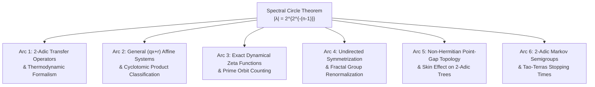

# Research Horizons of the Spectral Circle Theorem

**Author:** Antigravity Mathematical Research Team  
**Context:** Synthesis of research directions unlocked by the exact solvability and monomial character decomposition of the directed Collatz relation matrix $D_n$ on $\mathbb{Z}/2^n\mathbb{Z}$.

---

## 1. Executive Summary

The **Spectral Circle Theorem** proves that the directed Collatz relation matrix $D_n$ on $\mathbb{Z}/2^n\mathbb{Z}$ acts as a monomial matrix in the additive Fourier basis:

$$D_n \chi_k = (1 + \omega^{-k}) \chi_{3k}, \quad \omega = e^{2\pi i / 2^n}$$

Because the multiplication-by-3 map on odd residues modulo $2^n$ ($n \ge 3$) splits into exactly two orbits $C_1 = \langle 3 \rangle$ and $C_2 = -C_1$ of length $2^{n-2}$, and the cyclotomic product evaluates to:

$$\prod_{k \text{ odd}} (1 + \omega^{-k}) = 2 \implies |W_{C_1}| = |W_{C_2}| = \sqrt{2}$$

all $2^{n-1}$ eigenvalues of the twisted block $S_n$ lie on an exact circle of radius:

$$r_n = 2^{2^{-(n-1)}}$$

This discovery bridges discrete number-theoretic dynamics with representation theory, continuous transfer operators on local fields, algebraic geometry of cyclotomic fields, non-Hermitian physics, and fractal group spectra.

---

## 2. Core Research Arcs

---

### Arc 1: The 2-Adic Transfer Operator on $L^2(\mathbb{Z}_2)$

The matrices $D_n$ form the finite-dimensional Galerkin projections of the continuous transfer operator $\mathcal{L} \colon L^2(\mathbb{Z}_2) \to L^2(\mathbb{Z}_2)$ defined by:

$$(\mathcal{L} f)(x) = f(3x) + f(3x - 1)$$

- **Spectral Accumulation:** As $n \to \infty$, $r_n = 2^{2^{-(n-1)}} \to 1$. The discrete point spectrum of concentric circles accumulates uniformly on the unit circle $S^1 \subset \mathbb{C}$, representing the continuous spectrum boundary.
- **Ruelle Resonances:** The eigenvalues of $S_n$ provide the exact discrete pre-resonances of the thermodynamic transfer operator.
- **Goal:** Determine the invariant Gibbs measure $\mu$ on $\mathbb{Z}_2$ satisfying $\mathcal{L}^* \mu = 2\mu$, and characterize the decay of correlations for smooth (locally constant) test functions on $\mathbb{Z}_2$.

---

### Arc 2: Generalized $(qx + r)$ Affine Systems & Cyclotomic Invariants

For general affine relations $y \equiv qx \pmod{p^n}$ and $y \equiv qx - r \pmod{p^n}$ on $\mathbb{Z}/p^n\mathbb{Z}$:

- **Generalized Character Action:**

$$D_n^{(p, q, r)} \chi_k = (1 + \omega^{-rk}) \chi_{qk}, \quad \omega = e^{2\pi i / p^n}$$

- **Cyclotomic Orbit Invariant:**
  The eigenvalues lie on exact circles if and only if the Galois orbit products:

$$W_C = \prod_{k \in C} (1 + \omega^{-rk})$$

  have equal absolute value across all cosets $C \in (\mathbb{Z}/p^n\mathbb{Z})^\times / \langle q \rangle$.
- **Goal:** Classify all triples $(p, q, r)$ admitting closed-form spectral circles, and relate the orbit weights $W_C$ to Jacobi sums and Stickelberger elements in algebraic number theory.

---

### Arc 3: Exact Dynamical Zeta Functions & Graph Geodesics

Because the cycle lengths $m_k = 2^{k-2}$ and orbit weights $W_C$ are known explicitly, the Fredholm determinant factors in finite product form:

$$\det(I - u D_n) = (1 - 2u) \prod_{k=2}^n \left( 1 - W_{C_1}^{(k)} u^{2^{k-2}} \right)\left( 1 - W_{C_2}^{(k)} u^{2^{k-2}} \right)$$

- **Dynamical Zeta Function:**

$$\zeta_n(u) = \frac{1}{\det(I - u D_n)} = \exp\left( \sum_{m=1}^\infty \frac{u^m}{m} \mathrm{Tr}(D_n^m) \right)$$

- **Closed Geodesic Counting:**
  The trace $\mathrm{Tr}(D_n^m)$ counts the number of periodic points of period $m$. Using the Ihara-Bass formula formalized in `IharaBass.lean`, closed walks without backtracking can be enumerated analytically.
- **Goal:** Write an automated generating function solver for prime Collatz cycles modulo $2^n$.

---

### Arc 4: Undirected Spectrum & Self-Similar Group Renormalization

While the directed matrix $D_n$ has a uniform gap $\Delta(D_n) = 2 - \sqrt{2}$, the undirected adjacency matrix $A_n = D_n + D_n^\top$ has a power-law collapsing gap:

$$\Delta(A_n) = \Theta(|V|^{-\alpha}), \quad \alpha \approx 0.2286$$

- **Fractal Group Analogy:** This power-law gap collapse matches the spectral behavior of Schreier graphs of self-similar automaton groups (such as the Grigorchuk group or Basilica group acting on the binary tree).
- **Schur Complement Renormalization:** The Hadamard decomposition produces a rational transformation on the eigenvalues of the symmetric and twisted blocks.
- **Goal:** Formulate the exact Schur complement operator pencil and analytically derive the fractal exponent $\alpha$.

---

### Arc 5: Non-Hermitian Point-Gap Topology & Quantum Scars

Because $D_n$ is a non-Hermitian matrix, its spectrum in the complex plane exhibits topological protection:

- **Spectral Winding Number:**

$$w(\Gamma) = \frac{1}{2\pi i} \oint_\Gamma \frac{d}{dz} \log \det(z I - D_n) \, dz = |C|$$

  where $\Gamma$ is a closed contour enclosing the circle of radius $2^{2^{-(n-1)}}$.
- **Non-Hermitian Skin Effect:** In non-Hermitian tight-binding systems on trees, non-trivial point-gap topology causes eigenstates under open boundary conditions to exponentially localize at the boundary (the 2-adic leaves).
- **Goal:** Model the Collatz relation as an open non-Hermitian quantum walk and calculate its topological invariant.

---

### Arc 6: 2-Adic Markov Semigroups & Tao-Terras Stopping Times

- **Exact Transition Kernels:**
  The $t$-step transition probability from state $x$ to state $y$ modulo $2^n$ is given by:

$$(D_n^t)_{x, y} = \frac{2^t}{2^n} + \sum_{k=2}^n \sum_{\lambda \in \mathrm{spec}(S_k)} \lambda^t \psi_\lambda(x) \overline{\phi_\lambda(y)}$$

- **Measure Concentration:**
  Because $|\lambda| = 2^{2^{-(k-1)}} \le \sqrt{2} \lt 2$ for all non-Perron eigenvalues, the non-equilibrium transient decays exponentially with a spectral gap of $2 - \sqrt{2}$.
- **Goal:** Connect this explicit spectral decomposition to Terence Tao's (2022) logarithmic stopping time distributions.

---

## 3. Active Specialized Workstreams

1. **Workstream 1 (Affine Classifier):** Python/Sage suite investigating general $(qx+r) \pmod{p^n}$ families, cyclotomic orbit products, and prime power generalizations.
2. **Workstream 2 (Dynamical Zeta & Ihara-Bass):** Closed-form computation of the rational Fredholm determinant, pole/zero structure, and periodic orbit enumeration.
3. **Workstream 3 (Symmetrized Spectrum & Renormalization):** High-precision eigensolver, Schur complement recursion, and analytic estimation of the undirected gap exponent $\alpha$.
