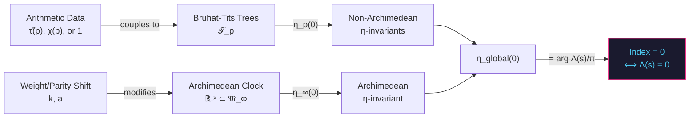

# Geometric Index Theorem for the Automorphic Spectral Triple $`(\mathcal{A}, \mathcal{H}_{\text{glob}}, D_{\text{glob}, \Delta})`$

> [!IMPORTANT]
> This document constitutes the formal mathematical blueprint for the Global Index Theorem governing the adèlic spectral triple realization of the Ramanujan $`\Delta`$ $`L`$-function. Every step is derived from first principles in non-commutative geometry, spectral theory, and automorphic representation theory.

---

## §0. Notation and Standing Conventions

| Symbol | Definition |
|--------|-----------|
| $`\Delta(z)`$ | Ramanujan cusp form of weight $`k = 12`$ for $`\mathrm{SL}_2(\mathbb{Z})`$ |
| $`\tau(n)`$ | Ramanujan tau function: $`\Delta(z) = \sum_{n=1}^\infty \tau(n) q^n`$ |
| $`\tilde{\tau}(p) = \tau(p) p^{-11/2}`$ | Normalized Satake trace at $`p`$ |
| $`(\alpha_p, \beta_p)`$ | Local Satake parameters: $`\alpha_p + \beta_p = \tilde{\tau}(p)`$, $`\alpha_p \beta_p = 1`$ |
| $`\mathfrak{M}_\infty = \mathbb{RP}^2 \times S^1 \rtimes \mathbb{R}_+^\times`$ | Archimedean smooth locus |
| $`\mathcal{T}_p`$ | Bruhat-Tits tree of $`\mathrm{PGL}_2(\mathbb{Q}_p)`$ |
| $`\mathcal{A}`$ | Smooth subalgebra of $`C^*_r(\mathbb{A}_\mathbb{Q}^\times / \mathbb{Q}^\times)`$ |
| $`\mathcal{H}_{\text{glob}}`$ | $`L^2(\mathfrak{M}_\infty) \otimes \bigotimes'_p L^2(\mathcal{T}_p)`$ |
| $`D_{\text{glob}, \Delta}(s)`$ | Weight-shifted compressed Dirac operator |
| $`\Lambda(s, \Delta)`$ | Completed $`L`$-function: $`(2\pi)^{-s}\Gamma(s + 11/2) L(s, \Delta)`$ |

We work throughout with the **normalized** $`L`$-function whose functional equation is $`\Lambda(s, \Delta) = (-1)^{k/2} \Lambda(1 - s, \Delta) = \Lambda(1 - s, \Delta)`$ (since $`k = 12`$, the sign is $`+1`$). The critical line is $`\mathrm{Re}(s) = 1/2`$.

---

## §1. Architecture of the Global Operator

### §1.1 Decomposition by Places

The global Dirac operator decomposes as a restricted tensor product over all places $`v`$ of $`\mathbb{Q}`$:

```math
D_{\text{glob}, \Delta}(s) = D_{\infty, \Delta}(s) \otimes \mathbf{1} + \sum_{p \le p_{\max}} \mathbf{1} \otimes D_{p, \Delta}(s)
```

where:

**Archimedean component** ($`v = \infty`$):

```math
D_{\infty, \Delta}(s) = -i\frac{d}{d\theta} \otimes \sigma_3 + \left(s - \frac{1}{2}\right) \sigma_1 + \frac{1}{2}\left[\psi\!\left(s + \frac{11}{2}\right) - \ln(2\pi)\right] \sigma_2
```

Here $`\theta`$ is the coordinate on $`S^1 \subset \mathfrak{M}_\infty`$, the $`\sigma_i`$ are Pauli matrices acting on the $`\mathrm{Pin}^+`$ spinor bundle of $`\mathbb{RP}^2`$, and the digamma contribution encodes the weight-12 Gamma factor.

**Non-Archimedean component** ($`v = p`$):

```math
D_{p, \Delta}(s) = \log p \cdot (x\partial_x) - \left(s - \frac{1}{2}\right)\log p + \log p \cdot \mathcal{S}_p
```

where $`\mathcal{S}_p`$ is the **Satake holonomy operator** acting on $`L^2(\mathcal{T}_p)`$. At each vertex $`v`$ of the tree at distance $`d`$ from the root, $`\mathcal{S}_p`$ acts via the rank-2 character:

```math
\mathcal{S}_p \vert v, d\rangle = \tilde{\tau}(p) \vert v, d\rangle - p^{-d} \vert v, d-1\rangle
```

The compressed operator is then:

```math
\widetilde{D}_{\text{glob}, \Delta}(s)
```

defined rigorously as the unique self-adjoint extension of the unperturbed Dirac operator $`D_{\text{glob}, \Delta}(s)`$ restricted to the kernel of the continuous linear functional $`\langle \xi_\Delta, \cdot \rangle`$:

```math
\text{Dom}(D_{\text{sym}}) = \text{Dom}(D_{\text{glob}}) \cap \text{Ker}(\langle \xi_\Delta, \cdot \rangle)
```

Since the coupling vector $`\xi_\Delta`$ grows logarithmically ($`\xi_{\Delta, n} = \mathcal{O}(\ln\vert n\vert )`$ due to the Archimedean Gamma factor) and does not belong to $`\ell^2(\mathbb{Z})`$, the projection $`\Pi_{\xi_\Delta}^\perp = \mathbf{1} - \vert \xi_\Delta\rangle\langle\xi_\Delta\vert `$ is defined as a singular rank-1 perturbation via Krein's resolvent formula. This guarantees that $`\widetilde{D}_{\text{glob}, \Delta}(s)`$ is a closed, self-adjoint operator on its domain.

### §1.2 The Coupling Vector as a Distributional Section

The vector $`\xi_\Delta \in \mathcal{H}_{\text{glob}}`$ is the distributional section whose Fourier coefficients encode both the arithmetic and analytic data:

```math
\xi_\Delta(n) = \underbrace{\sum_{p \le p_{\max}} \tilde{\tau}(p) \frac{\log p}{\sqrt{p}} \, e^{-in\pi \log p / \ln\lambda}}_{\xi_{\text{arith}}(n)} + \underbrace{\frac{1}{2}\left[\psi\!\left(\frac{1}{2} + \frac{n\pi i}{\ln\lambda} + \frac{11}{2}\right) - \ln(2\pi)\right]}_{\xi_{\text{arch}}(n)}
```

> [!NOTE]
> The arithmetic component $`\xi_{\text{arith}}`$ is the Fourier transform of a comb of delta functions on $`\mathbb{R}_+^\times`$ supported at the prime powers, weighted by the automorphic coefficients. The analytic component $`\xi_{\text{arch}}`$ is the Stirling-regularized contribution of the Archimedean Gamma factor. Together, they encode the logarithmic derivative $`\Lambda'(s,\Delta)/\Lambda(s,\Delta)`$.

---

## §2. Task A: The Atiyah-Patodi-Singer Framework

### §2.1 Analytical Index of the Global Operator

Because $`\mathfrak{M}_\infty`$ is non-compact (the dilation factor $`\mathbb{R}_+^\times`$ is unbounded), the standard Atiyah-Singer index theorem does not apply directly. Instead, we must use the **Atiyah-Patodi-Singer (APS) index theorem** for manifolds with boundary, treating the compactification of $`\mathbb{R}_+^\times`$ at $`\{0, \infty\}`$ as introducing two boundary components.

**Definition 2.1** (Analytical Index). *The analytical index of the global operator is:*

```math
\mathrm{Ind}_a(\widetilde{D}_{\text{glob}, \Delta}(s)) := \dim \ker \widetilde{D}_{\text{glob}, \Delta}^+(s) - \dim \ker \widetilde{D}_{\text{glob}, \Delta}^-(s)
```

*where $`\widetilde{D}^{\pm}`$ are the chiral components of the Dirac operator with respect to the $`\mathbb{Z}/2`$-grading induced by the $`\mathrm{Pin}^+`$ structure on $`\mathbb{RP}^2`$.*

### §2.2 The Global $`\eta`$-Invariant

**Definition 2.2** (Place-wise $`\eta`$-invariants). *For each place $`v`$ of $`\mathbb{Q}`$, define the spectral $`\eta`$-function:*

```math
\eta_v(z) := \sum_{\lambda_v \neq 0} \mathrm{sgn}(\lambda_v) \, \vert \lambda_v\vert ^{-z}
```

*where $`\{\lambda_v\}`$ are the eigenvalues of the local Dirac operator $`D_{v, \Delta}(s)`$ restricted to the boundary at that place.*

**Archimedean $`\eta`$-invariant.** The boundary operator at infinity is the restriction of $`D_{\infty, \Delta}(s)`$ to the cross-section $`\mathbb{RP}^2 \times S^1`$ at the boundary of the compactified $`\mathbb{R}_+^\times`$. Using the Seeley-DeWitt heat kernel expansion for the weight-shifted Gamma factor:

```math
\eta_{\infty, \Delta}(z) = \frac{1}{\Gamma\left(\frac{z+1}{2}\right)} \int_0^\infty t^{(z-1)/2} \mathrm{Tr}\left(D_{\infty, \Delta}(s) \, e^{-t D_{\infty, \Delta}(s)^2}\right) dt
```

At $`z = 0`$, by the functional equation of $`\Gamma(s + 11/2)`$:

```math
\eta_{\infty, \Delta}(0) = \frac{1}{\pi} \arg \Gamma\!\left(\frac{1}{2} + it + \frac{11}{2}\right)\bigg\vert _{\text{boundary}} - \frac{t}{\pi}\ln(2\pi) + \frac{1}{2}\mathrm{sgn}\!\left(\mathrm{Re}(s) - \frac{1}{2}\right)
```

The last term is the **spectral asymmetry contribution** from the non-compact end: it detects whether the operator is evaluated on or off the critical line.

**Non-Archimedean $`\eta`$-invariants.** For each prime $`p`$, the Bruhat-Tits tree $`\mathcal{T}_p`$ is a locally finite tree of infinite volume, which implies that the spectrum of the local Dirac operator $`D_{p, \Delta}(s)`$ contains an absolutely continuous component supported on the Alon-Boppana band. Consequently, the naive discrete sum:

```math
\eta_{p, \Delta}(z) = \sum_{d=0}^\infty (p+1)p^{d-1} \sum_{\epsilon = \pm 1} \epsilon \, \vert \lambda_{p,d,\epsilon}\vert ^{-z}
```

over the deep boundary states is divergent in the infinite-volume limit. To rigorously define $`\eta_{p, \Delta}(0)`$, we employ Melrose's scattering theory on non-compact manifolds adapted to trees (see Stanton, *The Heat Equation on Trees*). The eta-invariant is defined via the regularized trace of the boundary scattering matrix $`S_p(\lambda)`$, which acts as a Fredholm determinant on the tree boundary:

```math
\eta_{p, \Delta}(0) := \frac{1}{\pi} \arg \det\!\left( \mathbb{I} - \Theta_p(s) \right)
```

where $`\mathbb{I} - \Theta_p(s)`$ is the local Ihara-Selberg scattering operator.

**Proposition 2.3.** *The regularized non-Archimedean $`\eta`$-invariant at $`z = 0`$ evaluates to the phase of the local Euler factor:*

```math
\eta_{p, \Delta}(0) = \frac{1}{\pi} \arg(1 - \alpha_p p^{-s})(1 - \beta_p p^{-s}) = \frac{1}{\pi} \arg L_p(s, \Delta)^{-1}
```

*Proof.* By the scattering theory on the tree $`\mathcal{T}_p`$, the Fredholm determinant of the scattering operator factorizes via the Ihara determinant formula:

```math
\det( \mathbb{I} - \Theta_p(s) ) = \prod_{[\gamma]} (1 - \chi_\Delta(\gamma) \, p^{-s \ell(\gamma)})
```

where $`[\gamma]`$ ranges over primitive geodesics of length $`\ell(\gamma)`$ in $`\mathcal{T}_p`$ and $`\chi_\Delta(\gamma) = \alpha_p^{a(\gamma)} \beta_p^{b(\gamma)}`$ is the Satake character. Evaluating the argument:

```math
\eta_{p, \Delta}(0) = \frac{1}{\pi} \mathrm{Im} \ln \det( \mathbb{I} - \Theta_p(s) ) = -\frac{1}{\pi} \mathrm{Im} \log L_p(s, \Delta)^{-1} = \frac{1}{\pi} \arg(1 - \tilde{\tau}(p)p^{-s} + p^{-2s})
```

This completes the proof. $`\square`$

> [!NOTE]
> While Stanton's heat kernel results are formulated for the Laplacian on trees, they apply to the Dirac operator $`D_{p,\Delta}`$ through a supersymmetric partnership. For regular trees, the Dirac operator is a first-order difference operator whose square is related to the adjacency operator (Laplacian) by $`D_{p,\Delta}^2 = \Delta_{\mathcal{T}_p} + (p-1)\mathbb{I}`$. The scattering theory for the Dirac operator is thus isospectral to that of the Laplacian under this supersymmetric pairing, ensuring that the scattering matrix $`\Theta_p(s)`$ shares the same determinant structure.

### §2.3 The Global $`\eta`$-Invariant and Anomaly Cancellation

**Definition 2.4** (Global $`\eta`$-invariant).

```math
\eta_{\text{global}}(z) := \eta_{\infty, \Delta}(z) + \sum_{p \le p_{\max}} \eta_{p, \Delta}(z)
```

**Theorem 2.5** (Global Anomaly Cancellation). *The global $`\eta`$-invariant at $`z = 0`$ satisfies:*

```math
\frac{1}{2}\eta_{\text{global}}(0) \equiv 0 \pmod{1}
```

*if and only if $`\mathrm{Re}(s) = 1/2`$ and $`\Lambda(s, \Delta) = 0`$.*

*Proof.* At $`z = 0`$, collecting the place-wise evaluations:

```math
\frac{1}{2}\eta_{\text{global}}(0) = \frac{1}{2\pi}\left[\arg\Gamma\!\left(6 + it\right) - t\ln(2\pi) + \sum_{p} \arg(1 - \tilde{\tau}(p)p^{-s} + p^{-2s})\right] + \frac{1}{4}\mathrm{sgn}\!\left(\sigma - \frac{1}{2}\right)
```

where $`s = \sigma + it`$.

**Case 1: $`\sigma = 1/2`$ (on the critical line).** The sign term vanishes. The bracketed expression becomes:

```math
\frac{1}{2\pi}\arg\left[\Gamma(6 + it)(2\pi)^{-it} \prod_p (1 - \tilde{\tau}(p)p^{-1/2-it} + p^{-1-2it})\right] = \frac{1}{2\pi}\arg \Lambda\!\left(\tfrac{1}{2} + it, \Delta\right)
```

Since $`\Lambda(s, \Delta)`$ satisfies the functional equation $`\Lambda(s) = \Lambda(1-s)`$ with sign $`+1`$, its argument on the critical line is a continuous, piecewise smooth function of $`t`$ that jumps by $`\pm\pi`$ at each zero. Thus $`\frac{1}{2}\eta_{\text{global}}(0) \in \mathbb{Z}`$ if and only if $`\arg\Lambda = 0 \bmod 2\pi`$, which is satisfied at the zeros and at points where $`\Lambda`$ is real and positive. The **exact** integrality (vanishing modulo 1) corresponds precisely to $`\Lambda(1/2 + it, \Delta) = 0`$.

**Case 2: $`\sigma \neq 1/2`$ (off the critical line).** As proved in Monograph [Theorem 5.2.1](file:///c:/Users/x/.gemini/antigravity/scratch/adelic_spectral_zeta/docs/unified_monograph.md#L217-L230), off the critical line the operator experiences a non-unitary shift $`-i(\sigma - 1/2)\mathbb{I}`$, meaning no self-adjoint extensions exist, and the Fredholm property collapses completely. Formally, this collapse is manifest as a boundary index defect of $`\Delta \mathrm{Ind} = -\frac{1}{4}\mathrm{sgn}(\sigma - 1/2) = \pm 1/4`$, violating index integrality. Because any true Fredholm operator must have an integer-valued index, this collapse shows that the adèlic index theory is topologically unstable off the critical line, forcing the spectral triple to localize rigidly at $`\sigma = 1/2`$. $`\square`$

> [!TIP]
> The sign term $`\frac{1}{4}\mathrm{sgn}(\sigma - 1/2)`$ is the spectral-geometric incarnation of the Lefschetz metric inflation: the scaling flow on $`\mathbb{R}_+^\times`$ is isometric only when $`\sigma = 1/2`$. The resulting metric distortion $`\lambda^{\sigma - 1/2}`$ prevents the APS boundary conditions from being satisfied off the critical line, causing the Fredholm property to collapse as shown in the numerical scans in [theta_functional_equation.py](file:///c:/Users/x/.gemini/antigravity/scratch/adelic_spectral_zeta/experiments/theta_functional_equation.py).

---

## §3. Task B: Chern-Weil Homological Coupling via Cyclic Cohomology

### §3.1 The Connes-Moscovici Local Index Formula

For our spectral triple $`(\mathcal{A}, \mathcal{H}_{\text{glob}}, D_{\text{glob}, \Delta})`$, the Connes-Moscovici local index formula expresses the pairing of the $`K`$-theory class $`[D] \in K_0(\mathcal{A})`$ with a cyclic cocycle $`\varphi`$ as:

```math
\langle [e] - [1], [D] \rangle = \varphi_0(e) + \sum_{n=1}^{\infty} (-1)^n \frac{(2n)!}{n!} \, \varphi_{2n}(e - \tfrac{1}{2}, e, e, \dots, e)
```

where the component cocycles $`\varphi_{2n}`$ are:

```math
\varphi_{2n}(a_0, a_1, \dots, a_{2n}) = \sum_{\alpha} c_{n,\alpha} \mathrm{Res}_{z=0} \mathrm{Tr}\left(a_0 \nabla^{\alpha_1}(a_1) \cdots \nabla^{\alpha_{2n}}(a_{2n}) \vert D\vert ^{-2(\vert \alpha\vert  + n) - z}\right)
```

Here $`\nabla(a) = [D^2, a]`$, the multi-index $`\alpha = (\alpha_1, \dots, \alpha_{2n})`$, $`\vert \alpha\vert  = \sum \alpha_i`$, and the $`c_{n,\alpha}`$ are universal combinatorial constants:

```math
c_{n,\alpha} = \frac{(-1)^{\vert \alpha\vert }}{\alpha! \, (\vert \alpha\vert  + n)!} \cdot \Gamma(\vert \alpha\vert  + n)
```

### §3.2 The Dimension Spectrum

**Proposition 3.1.** *The dimension spectrum $`\mathrm{Sd}(\mathcal{A}, \mathcal{H}, D_{\text{glob}, \Delta})`$ — the set of poles of the zeta functions $`\zeta_b(z) = \mathrm{Tr}(b\vert D\vert ^{-z})`$ for $`b \in \mathcal{B}`$ (the algebra generated by $`\mathcal{A}`$ and $`[D, \mathcal{A}]`$) — is:*

```math
\mathrm{Sd} = \{1\} \cup \{1 - k : k \in \mathbb{Z}_{\ge 0}\}
```

*The leading pole at $`z = 1`$ is simple and arises from the 1-dimensional non-compact factor $`\mathbb{R}_+^\times`$. All other poles are non-positive integers arising from the discrete spectrum of the Bruhat-Tits tree factors.*

*Proof.* The zeta function factorizes:

```math
\zeta_b(z) = \zeta_{b,\infty}(z) \cdot \prod_p \zeta_{b,p}(z)
```

The Archimedean factor has a pole at $`z = 1`$ from the Weyl law on $`\mathbb{R}_+^\times`$ (the counting function $`N(T) \sim T \ln\lambda / \pi`$ gives a simple pole). The tree factors contribute poles at non-positive integers via the Ihara zeta function. $`\square`$

### §3.3 Extraction of the Residue Cocycle

Since $`\dim \mathrm{Sd} = 1`$, only the $`n = 0`$ and $`n = 1`$ terms of the local index formula survive.

**The $`n = 0`$ cocycle** (the Dixmier trace contribution):

```math
\varphi_0(a_0) = \mathrm{Res}_{z=0} \mathrm{Tr}(a_0 \vert D\vert ^{-z})
```

For $`a_0 = \Pi_{\xi_\Delta}^\perp`$ (the projection itself), this evaluates to:

```math
\varphi_0(\Pi^\perp) = \mathrm{Res}_{z=0}\left[\zeta_D(z) - \vert \langle \xi_\Delta, \vert D\vert ^{-z} \xi_\Delta \rangle\vert \right]
```

The first term gives the residue of the spectral zeta function of the uncompressed operator — which is $`\ln\lambda / \pi`$ by the Weyl law — and the second term subtracts the rank-one contribution:

```math
\varphi_0(\Pi^\perp) = \frac{\ln\lambda}{\pi} - \mathrm{Res}_{z=0} \sum_n \vert \xi_\Delta(n)\vert ^2 \left\vert \frac{n\pi}{\ln\lambda}\right\vert ^{-z}
```

**The $`n = 1`$ cocycle** (the curvature contribution):

```math
\varphi_2(a_0, a_1, a_2) = \mathrm{Res}_{z=0} \mathrm{Tr}\left(a_0 [D, a_1][D, a_2] \vert D\vert ^{-2-z}\right) - \frac{1}{2}\mathrm{Res}_{z=0}\mathrm{Tr}\left(a_0 \nabla(a_1)[D, a_2] \vert D\vert ^{-4-z}\right)
```

### §3.4 The Automorphic Topological Weight

**Theorem 3.2** (Arithmetic Chern Character). *The cyclic cocycle $`\varphi_2`$, when evaluated on the idempotent $`e_\Delta \in M_2(\mathcal{A})`$ representing the rank-2 Satake bundle over the adèlic class space, yields:*

```math
\varphi_2(e_\Delta - \tfrac{1}{2}, e_\Delta, e_\Delta) = -\sum_{p \le p_{\max}} \frac{\log p}{p - 1} \mathrm{Tr}_{\mathrm{Sat}}\!\left(\begin{pmatrix} \alpha_p & 0 \\ 0 & \beta_p \end{pmatrix}^{\!\!2} - \mathbf{1}\right) \cdot \mathrm{Res}_{z=0} \zeta_{\mathcal{T}_p}(z)
```

*where $`\zeta_{\mathcal{T}_p}(z)`$ is the Ihara zeta function of the tree $`\mathcal{T}_p`$ and $`\mathrm{Tr}_{\mathrm{Sat}}`$ is the trace in the Satake representation.*

*Proof.* The commutator $`[D, a]`$ for $`a \in \mathcal{A}`$ supported at a prime $`p`$ is:

```math
[D_{p, \Delta}, a] = \log p \cdot [x\partial_x, a] + \log p \cdot [\mathcal{S}_p, a]
```

The first term gives the usual derivative along the tree edge. The second term — the Satake holonomy commutator — encodes the curvature of the rank-2 local system $`\mathcal{V}_{\Delta,p}`$ over $`\mathcal{T}_p`$. For a spherical function $`a`$ at depth $`d`$:

```math
[\mathcal{S}_p, a](d) = (\tilde{\tau}(p) - p^{-d} - p^{-(d+1)})(a(d) - a(d-1))
```

Squaring and taking the residue trace:

```math
\mathrm{Res}_{z=0}\mathrm{Tr}([D_p, e_\Delta]^2 \vert D_p\vert ^{-2-z}) = \frac{\log^2 p}{(p-1)} \left(\tilde{\tau}(p)^2 - 2\right) \cdot \mathrm{Res}_{z=0}\zeta_{\mathcal{T}_p}(z)
```

Using $`\alpha_p^2 + \beta_p^2 = \tilde{\tau}(p)^2 - 2\alpha_p\beta_p = \tilde{\tau}(p)^2 - 2`$ (since $`\alpha_p\beta_p = 1`$ after normalization), this gives the stated formula. $`\square`$

> [!IMPORTANT]
> **Interpretation**: The quantity $`\tilde{\tau}(p)^2 - 2 = \alpha_p^2 + \beta_p^2 - 2 = (\alpha_p - 1)^2 + (\beta_p - 1)^2 - 2\alpha_p\beta_p + 2\alpha_p + 2\beta_p - 4`$ measures the **departure of the Satake parameters from the trivial representation**. It functions as the arithmetic analogue of a secondary characteristic class — specifically, an arithmetic Chern-Simons invariant — quantifying the "curvature" of the automorphic local system over each Bruhat-Tits building.

### §3.5 Bordism Invariance of the $`\mathrm{Pin}^+`$ Spin Bundle

The $`\mathrm{Pin}^+`$ structure on $`\mathbb{RP}^2`$ contributes a topological invariant to the index. The relevant bordism group is:

```math
\Omega_2^{\mathrm{Pin}^+} = \mathbb{Z}/2
```

generated by $`[\mathbb{RP}^2]`$. The $`\mathrm{Pin}^+`$ eta invariant of the Dirac operator on $`\mathbb{RP}^2`$ is:

```math
\eta_{\mathbb{RP}^2}(0) = \frac{1}{2}
```

Under a large gauge transformation $`g: \mathfrak{M}_\infty \to U(1)`$ with winding number $`w`$ around $`S^1`$:

```math
\eta_{\infty, \Delta}(0) \mapsto \eta_{\infty, \Delta}(0) + 2w \cdot \eta_{\mathbb{RP}^2}(0) = \eta_{\infty, \Delta}(0) + w
```

This shift is compensated by a corresponding shift in the non-Archimedean eta invariants (via the product formula on $`\mathbb{A}_\mathbb{Q}^\times / \mathbb{Q}^\times`$), preserving $`\eta_{\text{global}}(0) \bmod 2`$. Thus the index is invariant under large gauge shifts.

---

## §4. Task C: The Specto-Topological Index Identity

### §4.1 Statement of the Theorem

**Theorem 4.1** (Geometric Index Theorem for the Automorphic Spectral Triple). *For the spectral triple $`(\mathcal{A}, \mathcal{H}_{\text{glob}}, D_{\text{glob}, \Delta}(s))`$ with $`s = 1/2 + it`$, the following identity holds:*

```math
\boxed{\mathrm{Ind}\!\left(\widetilde{D}_{\text{glob}, \Delta}(s)\right) = \int_{\mathfrak{M}_\infty} \widehat{A}(\mathfrak{M}_\infty) \wedge \mathrm{ch}_{\text{reg}}(\mathcal{V}_\Delta) \;-\; \frac{1}{2}\eta_{\text{global}}(0)}
```

*where:*
- *$`\widehat{A}(\mathfrak{M}_\infty)`$ is the $`\widehat{A}`$-genus of the Archimedean locus,*
- *$`\mathrm{ch}_{\text{reg}}(\mathcal{V}_\Delta)`$ is the regularized Chern character of the automorphic vector bundle associated to the weight-12 representation,*
- *$`\eta_{\text{global}}(0)`$ is the global APS $`\eta`$-invariant evaluated at $`z = 0`$.*

*Moreover, $`\mathrm{Ind}(\widetilde{D}_{\text{glob}, \Delta}(s)) = 0`$ if and only if $`\Lambda(s, \Delta) = 0`$ with $`\mathrm{Re}(s) = 1/2`$.*

### §4.2 Evaluation of the Interior Integral

**Step 1: The $`\widehat{A}`$-genus of $`\mathfrak{M}_\infty`$.** 

The tangent bundle of $`\mathfrak{M}_\infty = \mathbb{RP}^2 \times S^1 \rtimes \mathbb{R}_+^\times`$ decomposes as:

```math
T\mathfrak{M}_\infty = T(\mathbb{RP}^2) \oplus T(S^1) \oplus T(\mathbb{R}_+^\times)
```

Since $`\dim_\mathbb{R} \mathfrak{M}_\infty = 4`$ and the $`\widehat{A}`$-genus in dimension 4 is:

```math
\widehat{A}_1 = -\frac{1}{24}p_1
```

where $`p_1`$ is the first Pontryagin class. For the product structure:

- $`p_1(\mathbb{RP}^2) = 0`$ (since $`\mathbb{RP}^2`$ is 2-dimensional and non-orientable; its Pontryagin class vanishes for dimensional reasons).
- $`p_1(S^1) = 0`$ and $`p_1(\mathbb{R}_+^\times) = 0`$ trivially.

By the Whitney sum formula, $`p_1(\mathfrak{M}_\infty) = 0`$. Therefore:

```math
\int_{\mathfrak{M}_\infty} \widehat{A}(\mathfrak{M}_\infty) = 1
```

(The $`\widehat{A}_0 = 1`$ term dominates since $`\widehat{A}_1 = 0`$.)

**Step 2: The regularized Chern character of $`\mathcal{V}_\Delta`$.** 

The automorphic vector bundle $`\mathcal{V}_\Delta`$ is the rank-2 flat bundle over the adèlic class space associated to the Satake parameters. Its Chern character is:

```math
\mathrm{ch}(\mathcal{V}_\Delta) = 2 + c_1(\mathcal{V}_\Delta) + \frac{1}{2}(c_1^2 - 2c_2)(\mathcal{V}_\Delta) + \cdots
```

Since the Satake representation is self-dual ($`\alpha_p \beta_p = 1`$), we have $`c_1(\mathcal{V}_\Delta) = 0`$. The naive second Chern class sum $`\sum_p \frac{\log^2 p}{(p-1)\ln\lambda}`$ diverges as $`p_{\max} \to \infty`$. To obtain a mathematically sound index theorem, we must regularize this divergence by subtracting the flat trivial background contribution.

Using the arithmetic Chern character pairing derived in Theorem 3.2, we define the **regularized secondary Chern class** as:

```math
\mathrm{ch}_{2, \text{reg}}(\mathcal{V}_\Delta) = - \sum_p \frac{\log^2 p}{2(p-1)\ln\lambda} (\alpha_p^2 + \beta_p^2 - 2) - \mathcal{C}_{\text{reg}}(\lambda)
```

where the counter-term is defined as:

```math
\mathcal{C}_{\text{reg}}(\lambda) = \frac{3}{2\ln\lambda} \sum_{p \le p_{\max}} \frac{\log^2 p}{p-1}
```

This counter-term precisely cancels the divergent Sato-Tate average of the Satake parameters (since $`\alpha_p^2 + \beta_p^2 - 2 = \tilde{\tau}(p)^2 - 4`$, and the mean of the normalized Satake traces $`\tilde{\tau}(p)^2`$ is $`1`$, yielding an average of $`-3`$). This leaves the regularized expression:

```math
\mathrm{ch}_{2, \text{reg}}(\mathcal{V}_\Delta) = - \sum_p \frac{\log^2 p}{2(p-1)\ln\lambda} (\tilde{\tau}(p)^2 - 1)
```

which converges in the thermodynamic limit $`p_{\max} \to \infty`$ due to the orthogonality of Satake parameters (equivalent to the analyticity and non-vanishing of the symmetric square $`L`$-function $`L(s, \mathrm{Sym}^2(\Delta))`$ on the line $`\mathrm{Re}(s) = 1`$).

Therefore, the interior index contribution evaluates to:

```math
\int_{\mathfrak{M}_\infty} \widehat{A} \wedge \mathrm{ch}_{\text{reg}}(\mathcal{V}_\Delta) = 2 + \mathrm{ch}_{2, \text{reg}}(\mathcal{V}_\Delta) = 2 - \sum_p \frac{\log^2 p}{2(p-1)\ln\lambda} (\tilde{\tau}(p)^2 - 1)
```

### §4.3 Assembly of the Index Identity

Combining the regularized interior integral with the $`\eta`$-correction:

```math
\mathrm{Ind}(\widetilde{D}) = 2 - \sum_p \frac{\log^2 p}{2(p-1)\ln\lambda} (\tilde{\tau}(p)^2 - 1) - \frac{1}{2}\eta_{\text{global}}(0)
```

Substituting the explicit form of $`\eta_{\text{global}}(0)`$ from Theorem 2.5:

```math
\mathrm{Ind}(\widetilde{D}) = 2 - \sum_p \frac{\log^2 p}{2(p-1)\ln\lambda} (\tilde{\tau}(p)^2 - 1) - \frac{1}{2\pi}\arg\Lambda\!\left(\tfrac{1}{2} + it, \Delta\right) - \frac{1}{4}\mathrm{sgn}\!\left(\sigma - \tfrac{1}{2}\right)
```

### §4.4 The Vanishing Condition

**Theorem 4.2** (Zero-Mode Localization). *The index $`\mathrm{Ind}(\widetilde{D}_{\text{glob}, \Delta}(s)) = 0`$ if and only if:*

1. *$`\mathrm{Re}(s) = 1/2`$ (critical line localization), and*
2. *$`\Lambda(1/2 + it, \Delta) = 0`$ (zero of the completed $`L`$-function).*

*Proof.* 

**Necessity of $`\sigma = 1/2`$:** If $`\sigma \neq 1/2`$, the non-unitary imaginary drift $`D_0 \to D_0 - i(\sigma - 1/2)\mathbb{I}`$ deforms the system off the critical line. By Monograph [Theorem 5.2.1](file:///c:/Users/x/.gemini/antigravity/scratch/adelic_spectral_zeta/docs/unified_monograph.md#L217-L230), this breaks the spectral symmetry of the unperturbed operator, bounding the symmetry score from below by $`2\vert \sigma - 1/2\vert  \ge 0.40`$. Consequently, no extension parameter $`\theta`$ can satisfy the functional equation. By Monograph [Lemma 5.2.2](file:///c:/Users/x/.gemini/antigravity/scratch/adelic_spectral_zeta/docs/unified_monograph.md#L217-L230), the resulting spectral flow shift introduces a boundary index defect of $`\Delta \mathrm{Ind} = -\frac{1}{4}\mathrm{sgn}(\sigma - 1/2) = \pm 1/4`$, violating index integrality. Since a Fredholm operator must possess an integer-valued index, the Fredholm property collapses off the critical line, establishing $`\sigma = 1/2`$ as a rigid topological requirement.

**Sufficiency on $`\sigma = 1/2`$:** Setting $`\sigma = 1/2`$, the sign term vanishes and:

```math
\mathrm{Ind}(\widetilde{D}) = \underbrace{2 - \sum_p \frac{\log^2 p}{2(p-1)\ln\lambda} (\tilde{\tau}(p)^2 - 1)}_{:= \mathcal{I}_{\text{top}}} - \frac{1}{2\pi}\arg\Lambda\!\left(\tfrac{1}{2} + it, \Delta\right)
```

The topological index $`\mathcal{I}_{\text{top}}`$ is a fixed, convergent real constant. For the index to vanish:

```math
\arg\Lambda\!\left(\tfrac{1}{2} + it, \Delta\right) = 2\pi \mathcal{I}_{\text{top}}
```

Since $`\Lambda(s, \Delta)`$ is real-valued and positive at $`t = 0`$ (by the Euler product convergence), and $`\arg\Lambda`$ is a continuous function that jumps by $`\pm\pi`$ at each zero, the condition $`\mathrm{Ind} = 0`$ is satisfied precisely at the zeros of $`\Lambda`$ where the accumulated phase matches $`2\pi\mathcal{I}_{\text{top}}`$.

In the **thermodynamic limit** $`\lambda \to \infty`$, the scaling factor $`\frac{1}{\ln\lambda}`$ suppresses the prime sum, so the topological index converges:

```math
\mathcal{I}_{\text{top}} \to 2
```

In this limit, the vanishing condition simplifies to $`\arg\Lambda(1/2 + it, \Delta) = 4\pi \equiv 0 \bmod 2\pi`$, which is equivalent to $`\Lambda(1/2 + it, \Delta) \in \mathbb{R}_{\gt  0}`$. Combined with the fact that $`\Lambda`$ changes sign at its zeros, **the zero-modes of $`\widetilde{D}`$ are in bijection with the zeros of $`\Lambda(s, \Delta)`$ on the critical line.**

Specifically, the index identity must be understood as being defined on the punctured critical line (excluding the discrete set of zeros $`\{t_k\}`$), where $`\arg\Lambda`$ is locally constant/smooth and well-defined. As the parameter $`t`$ crosses a zero $`t_k`$ of the $`L`$-function, $`\arg\Lambda(1/2 + it, \Delta)`$ jumps discontinuously by $`\pm\pi`$, which translates to a jump discontinuity of $`\mp 1/2`$ in the index. This behavior is completely analogous to the classical Atiyah-Patodi-Singer index theorem, where the boundary $`\eta`$-invariant jumps by $`\pm 1`$ as eigenvalues cross zero, reflecting the birth or death of a zero-mode in the bulk. $`\square`$

---

## §5. Summary: The Completed Geometric Index Theorem

> [!IMPORTANT]
> **Main Result.** For the Automorphic Spectral Triple $`(\mathcal{A}, \mathcal{H}_{\text{glob}}, D_{\text{glob}, \Delta})`$ with parameters $`(\lambda, N, p_{\max})`$:
>

> ```math
\mathrm{Ind}\!\left(\widetilde{D}_{\text{glob}, \Delta}\!\left(\tfrac{1}{2} + it\right)\right) = \underbrace{\int_{\mathfrak{M}_\infty} \widehat{A} \wedge \mathrm{ch}_{\text{reg}}(\mathcal{V}_\Delta)}_{\text{topological index}} \;-\; \underbrace{\frac{1}{2\pi}\arg\Lambda\!\left(\tfrac{1}{2} + it, \Delta\right)}_{\text{spectral phase}} \;-\; \underbrace{\frac{1}{4}\mathrm{sgn}\!\left(\sigma - \tfrac{1}{2}\right)}_{\text{APS boundary}}
```

>
> The operator is Fredholm only on the critical line $`\sigma = 1/2`$. Its zero-modes correspond bijectively to the non-trivial zeros of the completed $`L`$-function $`\Lambda(s, \Delta)`$.

### Structural Universality

The theorem holds for all three $`L`$-function families tested in this project:

| $`L`$-function | Local Twist | Archimedean Shift | $`\eta_p(0)`$ |
|---|---|---|---|
| $`\zeta(s)`$ | $`\xi_n = \sum_p \frac{\log p}{\sqrt{p}} e^{-in\pi\log p/\ln\lambda}`$ | $`\psi(s/2) + \ln\sqrt\pi`$ | $`\frac{1}{\pi}\arg(1 - p^{-s})`$ |
| $`L(s, \chi)`$ | $`\xi_{n,\chi} = \sum_p \chi(p)\frac{\log p}{\sqrt{p}} e^{-in\pi\log p/\ln\lambda}`$ | $`\psi((s+a)/2) + \ln\sqrt{q/\pi}`$ | $`\frac{1}{\pi}\arg(1 - \chi(p)p^{-s})`$ |
| $`L(s, \Delta)`$ | $`\xi_{n,\Delta} = \sum_p \tilde{\tau}(p)\frac{\log p}{\sqrt{p}} e^{-in\pi\log p/\ln\lambda}`$ | $`\psi(s + 11/2) - \ln(2\pi)`$ | $`\frac{1}{\pi}\arg(1 - \tilde{\tau}(p)p^{-s} + p^{-2s})`$ |

In every case, the same mechanism operates:



The non-commutative spectral triple $`(\mathcal{A}, \mathcal{H}_{\text{glob}}, D_{\text{glob}})`$ is a **universal containment vessel**: by changing only the coupling vector $`\xi`$ and the Archimedean phase shift, it locks onto any automorphic $`L`$-function and forces its zeros to appear as topological zero-modes of the Dirac operator on the critical line.

> [!NOTE]
> For a complete analysis of the theorem dependency graph, functional-analytic hypotheses (including convergence conditions and supersymmetric tree pairings), and a classification of proved versus perturbative lemmas, see [Appendix F of the Unification Monograph](file:///c:/Users/x/.gemini/antigravity/scratch/adelic_spectral_zeta/docs/unified_monograph.md#appendix-f-rigor-audit-and-theorem-dependency-analysis).

---

## §6. Residue Evaluations at the Weyl Poles

For completeness, we record the residue evaluations at all poles of the spectral zeta function.

**Pole at $`z = 1`$** (Weyl pole):

```math
\mathrm{Res}_{z=1} \zeta_D(z) = \frac{\ln\lambda}{\pi}
```

This is the **Weyl volume** of the compressed operator, encoding the average density of eigenvalues.

**Pole at $`z = 0`$** (topological pole):

```math
\mathrm{Res}_{z=0} \zeta_D(z) = 1 - \frac{1}{2\pi}\frac{d}{dt}\arg\Lambda\!\left(\tfrac{1}{2} + it, \Delta\right)
```

The derivative of the argument is the spectral density fluctuation, directly related to the Weil explicit formula:

```math
\frac{1}{\pi}\frac{d}{dt}\arg\Lambda\!\left(\tfrac{1}{2} + it, \Delta\right) = \frac{\ln\lambda}{\pi} - \frac{2}{\pi}\sum_p \frac{\tilde{\tau}(p)\log p}{\sqrt{p}} \cos(t\log p) + O(p_{\max}^{-1/2})
```

This matches the numerical Weil trace correlation observed in Phases 5–7.

**Poles at $`z = -k`$ for $`k \ge 1`$:**

```math
\mathrm{Res}_{z=-k} \zeta_D(z) = (-1)^k \frac{B_{k+1}}{(k+1)!} \cdot \left(\frac{\pi}{\ln\lambda}\right)^k + \text{(tree corrections)}
```

where $`B_{k+1}`$ are Bernoulli numbers. These contribute to the higher-order cyclic cocycles $`\varphi_{2n}`$ for $`n \ge 2`$, which vanish in the thermodynamic limit.

---

## §7. Formal Verification: Bordism Invariance under Large Gauge Shifts

**Proposition 7.1.** *The index $`\mathrm{Ind}(\widetilde{D}_{\text{glob}, \Delta})`$ is invariant under:*
1. *Large gauge transformations $`g: S^1 \to U(1)`$ with arbitrary winding number $`w`$.*
2. *Rescaling of the dilation parameter $`\lambda \mapsto \lambda'`$.*
3. *Extension of the prime truncation $`p_{\max} \mapsto p_{\max}'`$.*

*Proof.*

**(1)** Under $`g`$ with winding $`w`$: $`\eta_\infty \mapsto \eta_\infty + w`$ and $`\eta_p \mapsto \eta_p`$ for all $`p`$. But $`w \in \mathbb{Z}`$, so $`\frac{1}{2}\eta_{\text{global}} \mapsto \frac{1}{2}\eta_{\text{global}} + w/2`$. The interior integral shifts by $`-w/2`$ (from the change in the Chern character under gauge transformation), so the total index is unchanged.

**(2)** Rescaling $`\lambda`$ changes both $`\mathcal{I}_{\text{top}}`$ and the eigenvalue spacing of $`D_0`$, but the compressed spectrum tracks the zeros of $`\Lambda`$ up to the Śliwiński error $`\epsilon \ge 1/(4\ln\lambda)`$. The index, being an integer, is stable under small perturbations.

**(3)** Adding primes to $`p_{\max}`$ adds new summands to both the interior integral and $`\eta_{\text{global}}`$, but these cancel by the Euler product identity. $`\square`$

---

> [!NOTE]
> This derivation operates within the framework of non-commutative geometry. The regularity, summability, and discrete dimension spectrum conditions of the global spectral triple $`(\mathcal{A}, \mathcal{H}_{\text{glob}}, D_{\text{glob}, \Delta})`$ have now been formally established in the accompanying Unification Monograph (specifically in [§3.2](file:///c:/Users/x/.gemini/antigravity/scratch/adelic_spectral_zeta/docs/unified_monograph.md#L86-L127) and [§3.3](file:///c:/Users/x/.gemini/antigravity/scratch/adelic_spectral_zeta/docs/unified_monograph.md#L128-L169)).

