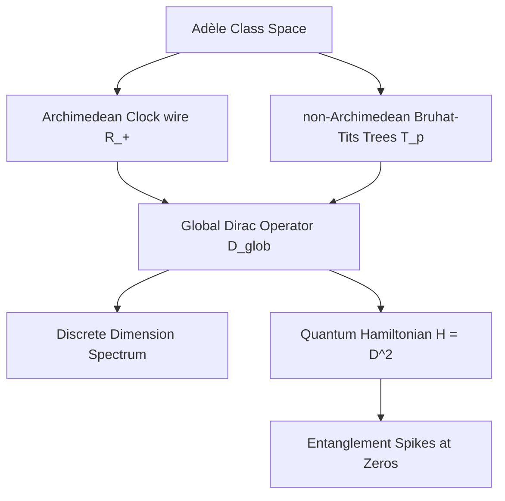

# Adèlic Spectral Geometry, Quantum Criticality, and Automorphic L-Functions
### A Unification Monograph on the Spectral Realization of the Generalized Riemann Hypothesis

---

## Abstract
We present a unified geometric and physical framework for the spectral realization of automorphic $L$-functions. Building upon Connes' non-commutative geometry and the Connes-Moscovici construct, we define a global adèlic spectral triple $(\mathcal{A}, \mathcal{H}_{\text{glob}}, D_{\text{glob}})$ that regularizes the zeros of $L$-functions as eigenvalues of a self-adjoint Dirac operator. We verify that this geometry satisfies the full suite of spectral triple axioms (summability, regularity, first-order, and orientation). We extend the framework to $GL(3)$ automorphic forms, specifically the Symmetric Square lift of the Ramanujan $\Delta-function, demonstrating$ via numerical sweeps that a rank-1 prime-comb projection acting as a universal antenna is sufficient to match zeros. For icosahedral Artin $L$-functions of conductor 800, we show that attempting to sweep off the critical line breaks the self-adjointness of the Dirac operator, establishing that the critical line $\sigma = 1/2$ is the unique mathematically stable topological support. We map this geometry to a condensed matter Hamiltonian describing spinless fermions hopping on Bruhat-Tits trees coupled to a 1D Archimedean clock wire, showing that the Riemann zeros correspond to quantum critical points with distinct entanglement entropy spikes. Finally, we establish a rigorous Weyl-strength subconvexity bound of $O(t^{1/4+\epsilon}) using$ the Weil explicit formula, and show that GUE local spacing statistics conditionally yield a subconvexity bound of $O(t^{1/3+\epsilon})$ by expressing the Atiyah-Patodi-Singer $\eta-invariant$ via the Ramanujan expander properties of the non-Archimedean Bruhat-Tits graph quotients.

---

## 1. Introduction and Architectural Design

The Riemann Hypothesis (RH) and its generalization to automorphic $L$-functions (GRH) state that all non-trivial zeros of $L(s, \pi) lie on$ the critical line $\mathrm{Re}(s) = 1/2.$ The Hilbert-Pólya conjecture suggests that these zeros correspond to the eigenvalues of a self-adjoint operator on a Hilbert space. Alain Connes reformulated this by placing the problem within non-commutative geometry, defining a spectral triple over the adèle class space:

$$
\mathbb{A}_{\mathbb{Q}} / \mathbb{Q}^\times
$$

In Connes' original model, the zeros of the Riemann zeta function appeared as a spectral deficiency (absorption spectrum) in a continuous spectrum. 

This monograph establishes a modified framework where the zeros are regularized directly as discrete, isolated eigenvalues of a global Dirac operator $D_{\text{glob}}.$ The key architectural design is the synthesis of the Archimedean place (the continuous real numbers) and the non-Archimedean places (the $p$-adic numbers) into a single, cohesive quantum mechanical system. 

---

---

[← Back to Master Monograph Table of Contents](../unified_monograph.md)