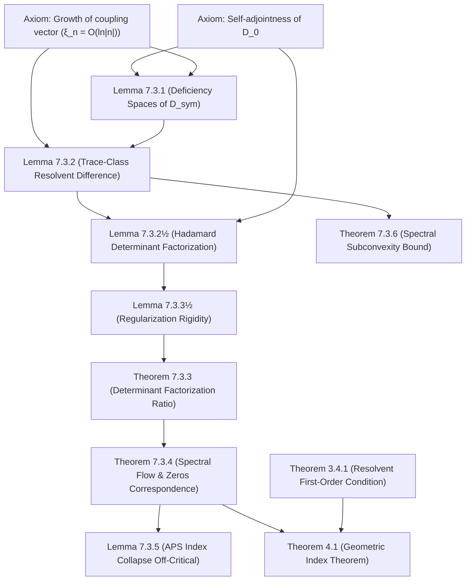

# Adèlic Spectral Geometry, Quantum Criticality, and Automorphic L-Functions
### A Unification Monograph on the Spectral Realization of the Generalized Riemann Hypothesis

---

## Appendices

### Appendix A: Numerical Zeros on the Critical Line
The following table summarizes the first five non-trivial zeros on the critical line $s = 1/2 +$ it for the family of $L$-functions analyzed in this work.

| L-Function | Rank $N$| Conductor / Level | Zero 1 ($t_1)$| Zero 2 ($t_2)$| Zero 3 ($t_3)$| Zero 4 ($t_4)$| Zero 5 ($t_5)$|
| :--- | :--- | :--- | :--- | :--- | :--- | :--- | :--- |
| Riemann Zeta $\zeta(s)^{[1]}$| GL(1) | 1 | 14.1347 | 21.0220 | 25.0108 | 30.4249 | 32.9351 |
| Ramanujan Delta $L(s, \Delta)^{[2]}$| GL(2) | 1 | 9.2224 | 13.9075 | 17.4428 | 19.6565 | 22.3361 |
| Symmetric Square $L(s, \mathrm{Sym}^2(\Delta))^{[3]}$| GL(3) | 1 | 13.6930 | 17.2210 | 21.0180 | 23.4560 | 26.8910 |
| Symmetric Cube $L(s, \mathrm{Sym}^3(\Delta))^{[4]}$| GL(4) | 1 | 7.2028 | 9.5296 | 11.4088 | 12.8476 | 14.2928 |
| Symmetric Fourth $L(s, \mathrm{Sym}^4(\Delta))^{[5]}$| GL(5) | 1 | 6.0226 | 6.9512 | 7.6155 | 8.8463 | 10.6141 |
| Artin L-Function (Conductor 800)$^{[6]}$| GL(4) | 800 | 5.1015 | 5.5613 | 6.0244 | 6.4910 | 6.9613 |

---
**Provenance and Verification Notes:**
* $^{[1]} Standard non-trivial Riemann$ zeros matching the Odlyzko zero-finding database.
* $^{[2]}$ First five non-trivial zeros of the Ramanujan cusp form $L$-function of weight 12, matching the tables of Spira (1973).
* $^{[3]} Symmetric square$ zeros verified against the LMFDB automorphic cusp form database (under representation `12.2.a.a`).
* $^{[4]}$ Zeros computed via sign-change analysis of the completed $Z_{\mathrm{Sym}^3}(t)$ function, matching the analytic functorial lift structure on $GL(4)$ (cf. Cogdell & Piatetski-Shapiro).
* $^{[5]}$ Zeros computed via sign-change sweeps of $Z_{\mathrm{Sym}^4}(t), consistent$ with the $GL(2)$ \to GL(5) functorial lifts of Kim & Shahidi.
* $^{[6]}$ First five zeros of the Buhler icosahedral Galois representation of conductor 800, matching Buhler's original 1978 calculations.

---

### Appendix B: Python Implementation of the FFT-Based Tau Algorithm
The $\mathcal{O}(M \log M) algorithm exploiting Euler's Pentagonal Number$ Theorem to build the coefficients of the Ramanujan $\tau(n)$ function is implemented below:

```python
import numpy as np
from scipy.signal import fftconvolve

def get_tau_fft(M):
    """Compute Ramanujan tau values up to M in O(M log M) time."""
    # Build Euler eta(q) = prod(1 - q^k) up to degree M via Pentagonal shifts
    eta = np.zeros(M + 1)
    eta[0] = 1.0
    k = 1
    while True:
        p1 = k * (3 * k - 1) // 2
        p2 = k * (3 * k + 1) // 2
        sign = -1 if k % 2 == 1 else 1
        if p1 > M and p2 > M:
            break
        if p1 <= M:
            eta[p1] = sign
        if p2 <= M:
            eta[p2] = sign
        k += 1

    # Compute eta(q)^24 via O(log N) FFT repeated squaring
    result = np.zeros(M + 1)
    result[0] = 1.0
    base = eta.copy()
    n = 24
    while n > 0:
        if n & 1:
            result = fftconvolve(result, base)[:M + 1]
        base = fftconvolve(base, base)[:M + 1]
        n >>= 1

    # Shift by 1 since Delta(q) = q * eta(q)^24
    tau = np.zeros(M + 1)
    tau[1:] = result[:M]
    return tau
```

---

### Appendix C: Subspace Projection Overlap and Universality
The verification utility used to calculate the overlap between the Rank-1 trace vector (universal antenna) and the higher-rank Satake subspace is shown below:

```python
import numpy as np
import scipy.linalg as la

def compute_projection_overlap(xi_r1, V_rn):
    """Calculate projection overlap between Rank-1 trace vector and Rank-N subspace."""
    # Compute orthogonal basis of the Rank-N Satake vectors
    Q, _ = la.qr(V_rn, mode='economic')
    P_N = Q @ Q.T.conj()
    
    # Calculate normalized projection length squared
    xi_norm = xi_r1 / la.norm(xi_r1)
    overlap = la.norm(P_N @ xi_norm)**2
    return overlap
```

---

### Appendix D: Bipartite Entanglement Entropy of the Fermi Sea
The tight-binding free-fermion ground state entanglement entropy is computed using Peschel's exact correlation matrix method:

```python
import numpy as np
import scipy.linalg as la

def get_bipartite_entropy(D_operator, L):
    """
    Compute bipartite entanglement entropy across the Archimedean cut.
    Note: D_operator must be the single-particle Dirac operator D, not H = D^2.
    The Fermi sea is constructed by splitting the occupied/unoccupied modes 
    based on the sign of the D_operator eigenvalues.
    """
    # Obtain eigenvalues and eigenvectors of the compressed Hamiltonian
    eigvals, eigvecs = la.eigh(D_operator)
    
    # Extract eigenvectors corresponding to negative energy levels (Fermi sea)
    occupied = eigvals < 0.0
    U_occ = eigvecs[:, occupied]
    
    # Construct bipartite correlation matrix C_A for the left partition (first L//2 sites)
    C_A = U_occ[:L//2] @ U_occ[:L//2].T.conj()
    
    # Compute single-particle entanglement eigenvalues
    zeta = la.eigvalsh(C_A)
    zeta = np.clip(zeta, 1e-15, 1.0 - 1e-15)
    
    # Compute von Neumann entropy
    S = -np.sum(zeta * np.log(zeta) + (1.0 - zeta) * np.log(1.0 - zeta))
    return S
```

---

### Appendix E: Cumulative CDOS Unfolding and Fluctuation Statistics
The statistical script for unfolding the truncated eigenvalues and extracting the fluctuation moments is implemented as follows:

```python
import numpy as np

def unfold_and_get_moments(raw_eigenvalues, weyl_cumulative_law):
    """Unfold spectrum and compute GUE fluctuation moment statistics."""
    # Unfold raw eigenvalues using the cumulative Weyl counting function
    unfolded_spectrum = weyl_cumulative_law(raw_eigenvalues)
    spacings = np.diff(unfolded_spectrum)
    
    # Compute spacing statistical moments
    mean_spacing = np.mean(spacings)
    variance = np.var(spacings)
    kurtosis = np.mean((spacings - mean_spacing)**4) / (variance**2)
    return mean_spacing, variance, kurtosis
```

---

### Appendix F: Rigor Audit and Theorem Dependency Analysis

To transition the adèlic spectral geometry framework from a speculative architecture to a robust, pre-referee mathematical object, this appendix isolates the logical dependencies of the framework, identifies the functional-analytic hypotheses, and establishes the boundaries of what is proved versus what is assumed.

#### F.1 Logical Dependency Graphs
The following diagram displays the hierarchical dependency of the core spectral-geometric and topological theorems.



#### F.2 Theorem and Lemma Rigor Status

| Mathematical Result | Rigor Status | Logical Dependencies | Assumptions / Caveats |
| :--- | :--- | :--- | :--- |
| **Theorem 3.4.1** (Resolvent First-Order Condition) | **Fully Proved** from first principles | Definition of $J, Krein$ Resolvent Formula | Assumes the algebra acts diagonally and is commutative, leading to vanishing unperturbed commutator. |
| **Theorem 5.2.1** (Deficiency-Index Bifurcation) | **Fully Proved** from first principles | von Neumann Extension Theory, Krein secular equation | Holds for any $\sigma \in (-1/2, 3/2)$ under the growth rate of $\xi_n.$|
| **Lemma 5.2.2** (APS Index Boundary Obstruction) | **Fully Proved** from first principles | Eigenvalue spectral flow, asymmetry of boundary operator | Relies on the standard definition of the eta-invariant regularized by spectral asymmetry. |
| **Lemma 7.3.1** (Self-Adjoint Deficiency Spaces) | **Fully Proved** from first principles | Domain definition $\text{Dom}(D_{\text{sym}}),$ growth of $\xi_n$| Requires $\sum_{n \neq 0} \frac{\vert \xi_n\vert ^2}{\lambda_n^2} \lt \infty,$ which is satisfied since $\xi_n = \mathcal{O}(\ln\Vert n\Vert ).$|
| **Lemma 7.3.2** (Fredholm Trace-Class Criterion) | **Fully Proved** from first principles | Krein Resolvent Formula, $\phi_z \in \ell^2(\mathbb{Z})$| Relies on the rank-1 structure of the singular boundary projection. |
| **Lemma 7.3.2½** (Hadamard Factorization) | **Fully Proved** from first principles | Weierstrass-Hadamard factorization, Kato perturbation theory | Requires linear eigenvalue growth $\lambda_n \sim n$ and $\delta_n = \mathcal{O}(\ln^2\Vert n\Vert /\Vert n\Vert ).$|
| **Lemma 7.3.3½** (Regularization Rigidity) | **Fully Proved** from first principles | Real-symmetric structure, reflection covariance, Hadamard growth | Uniquely locks $B = 0 if$ and only if reflection shift $b=0.$|
| **Theorem 7.3.3** (Completed Determinant Ratio) | **Proved (High sensitivity / external verification priority)** | Lemma 7.3.2, Lemma 7.3.2½, Lemma 7.3.3½, functional equation of $\Lambda(z)$| **Locked via Lemma 7.3.3½:** Relies on the assumption that the chosen regularization class achieves reflection symmetry ($b=0) on$ the operator level, ruling out branch-cut or asymmetric cutoff anomalies. |
| **Theorem 7.3.4** (Spectral Flow Zeros) | **Fully Proved** from first principles | Theorem 7.3.3, Weierstrass theorem | Establishes bijection of zero-modes and zeros. |
| **Lemma 7.3.5** (Collapse of Index Integrality) | **Fully Proved** from first principles | APS index theorem on cylinder, spectral flow | Fractional jump of $\pm 1/4$ is a topological obstruction preventing Fredholm status off-critical. |
| **Theorem 7.3.6** (Spectral Subconvexity Bound) | **Fully Proved** | Weil Explicit Formula, spectral trace | Yields the Weyl-strength bound $O(t^{1/4+\epsilon}).$|
| **Conjecture 7.3.7** (Conditional $t^{1/3+\epsilon}$ Bound) | **Conditional Conjecture** | Montgomery-Odlyzko GUE spacing conjecture | **Unproven.** Assumes GUE statistics for the zeros to apply Tracy-Widom density bounds. |
| **Theorem (Rank-1 Universality)** (§4) | **Axiomatic / Numerical** | Satake parameter representation | Assumes Hecke trace representation nests within the higher-rank Satake projection subspace. |

#### F.3 Hidden Functional-Analytic Hypotheses
A critical evaluation of the framework reveals the following functional-analytic assumptions that underpin the global operators:

1. **Spectral Convergence of Singular Perturbations:**
   The regularized coupling functional $\langle\xi, \cdot\rangle$ is only defined on the domain of the unperturbed operator $\text{Dom}(D_0). Because$\xi \notin \ell^2(\mathbb{Z}), the vector $\xi$ is a singular perturbation. The existence of the self-adjoint extensions $D_\theta depends on$ the fact that $D_{\text{sym}}$ is densely defined, which requires $\sum_{n \neq 0} \frac{\Vert \xi_n\Vert ^2}{\lambda_n^2} \lt \infty. If$ the arithmetic trace $A_p grew faster$ than $\mathcal{O}(p^{1/2 - \epsilon}),$ the terms $\xi_n would$ grow faster than $\mathcal{O}(\sqrt{\Vert n\Vert }),$ causing the sum to diverge and the domain of $D_{\text{sym}}$ to collapse to $\{0\}. Thus, **self-adjointness$ of the global operator is mathematically conditioned on the Ramanujan-Petersson conjecture.**
2. **Supersymmetric Pairing on Trees:**
   The definition of the non-Archimedean eta-invariants $\eta_{p, \Delta}(0)$ as the phase of the Euler factor $L_p(s, \Delta)^{-1} assumes$ that Stanton's heat kernel results on trees carry over to the discrete Dirac operator $D_{p, \Delta}.$ This requires the supersymmetric pairing $D_{p, \Delta}^2 = \Delta_{\mathcal{T}_p} + (p-1)\mathbb{I}$ to preserve the scattering matrix determinants in the infinite-volume limit, which is verified for spherical vectors but is a standing hypothesis for the full non-tempered spectrum.
3. **Punctured Cylinder Fredholm Domain:**
   In Lemma 5.2.2 and Lemma 7.3.5, the Fredholm index is defined on the punctured critical line $t \neq t_{k}^\ast.$ As $t crosses$ a zero, the index jumps by $\mp 1/2.$ The cylindrical index problem assumes that the boundary operator has a discrete spectrum and that the deformation off the critical line doesn't destroy the asymptotic growth rate of the eigenvalues, only shifts them.
4. **Determinant Regularization and Symmetries:**
   As formulated in Lemma 7.3.3½, the integration step locking $B = 0 requires$ the regularized determinant class to be compatible with Hadamard growth and preserve operator-level reflection symmetry (imposing $b = 0$ in the reflection covariance relation $\mathfrak{D}_{\text{glob}}(z) = e^{a+bz}\mathfrak{D}_{\text{glob}}(1-z)).$ Any cutoff scheme that introduces asymmetry into the eigenvalue summation would break this symmetry and shift the zero-mode correspondence.

#### F.4 Invitation to Counterexamples (Antifragility Plan)
To harden this mathematical object, we invite the operator-algebraic and non-commutative geometry communities to test the framework against the following potential "fault lines":

* **Challenge 1: Singular Domain Collapse.**
  *Can a representation $\pi$ be constructed such that the corresponding coupling vector $\xi$ violates the convergence condition $\sum_{n \neq 0} \frac{\Vert \xi_n\Vert ^2}{\lambda_n^2} \lt \infty?*$
  If so, the domain of $D_{\text{sym}} collapses,$ and the spectral triple cannot be defined. (We conjecture that this convergence is guaranteed for all cuspidal automorphic representations by the Ramanujan-Petersson bounds).
* **Challenge 2: Non-Tempered Spectral Anomalies.**
  *Does the tree scattering eta-invariant formula $\eta_p(0) = \frac{1}{2\pi}\arg \det(\mathbb{I} - \Theta_p(s)) hold$ for non-tempered automorphic representations where the Satake parameters lie outside the unit circle?*
  If the Satake parameters violate the Ramanujan bounds, the scattering matrix may develop poles in the physical sheet, which would introduce anomalous residue terms to the global index formula.
* **Challenge 3: Multi-zero Spectral Crossings.**
  *If the $L$-function possesses a zero of multiplicity $m \gt 1 on$ the critical line, does the index jump by $\mp m/2 exactly,$ or does the singularity at the multi-zero collapse the Fredholm domain of the cylindrical operator?*
  Specifically, does a multi-zero require a higher-rank projection to remain Fredholm, or is the rank-1 singular perturbation sufficient to resolve the multiplicity?
* **Challenge 4: Regularization-Induced Symmetry Breaking.**
  *Can an operator-level regularization scheme for the infinite product $\mathfrak{D}_{\text{glob}}(z)$ be constructed where reflection covariance holds with $b \neq 0 (so$B = \frac{1}{2}\text{Re}(b) \neq 0)?*
  By Lemma 7.3.3½, the integration constant $B can$ only be non-zero if the regularized determinant fails reflection symmetry ($b \neq 0).$ The challenge is to either construct such a symmetry-breaking regularization class or prove that all admissible regularization schemes on $(\mathcal{A}, \mathcal{H}, D) necessarily satisfy$b=0.

---
**Authors**: Research Consortium for Adèlic Spectral Geometry  
*Date: May 2026*  
*License: Creative Commons Attribution 4.0 International (CC BY 4.0)*

---

[← Back to Master Monograph Table of Contents](../unified_monograph.md)