# Chapter 11: The Erdős Similarity Conjecture via Adèlic Spectra

---

## 11.1 Introduction
The **Erdős Similarity Conjecture** (1974), also known as the "universal in measure" problem, is a fundamental open problem in geometric measure theory. It asserts that for any infinite set of real numbers $`S \subset \mathbb{R}`$, there exists a set $`E \subset \mathbb{R}`$ of positive Lebesgue measure ($`m(E) \gt 0`$) containing no affine copy of $S$:

$$
\forall a \in \mathbb{R}, \, b \neq 0 \quad a + b S \not\subset E
$$

In other words, no infinite set is "universal in measure." Erdős conjectured this holds in particular for null sequences converging to 0.

### 11.1.0 Main Theorem (Adèlic Avoidance for Geometric Sequences)
**Theorem 11.1.0 (Adèlic Avoidance for Geometric Sequences)**  
*Let $`S = \{\alpha q^{-n}\}_{n=1}^\infty`$ be a geometric sequence with integer base $`q \ge 2`$ and real scale parameter $`\alpha \in \mathbb{R} \setminus \{0\}`$. There exists an adèlic product set $`\mathcal{E} = E \times C_{p_1} \times C_{p_2}`$ with positive measure continuous factor $`E \subset \mathbb{R}`$ and Cantor filters $`C_{p_i}`$ that contains no adèlic affine copies of $S$:*

$$
\forall a \in X_L, \, b \neq 0 \quad a + b S \not\subset \mathcal{E}
$$

*This result highlights the conditional nature of the adèlic bridge. The transition from Adèlic Avoidance to unconditional Real Avoidance for the Erdős Similarity Conjecture remains an unresolved heuristic. The direct adèlic-guided fat Cantor set construction attempts to close this gap but operates fundamentally as a discrete model.*

Rather than attempting to prove containment, this chapter constructs an **adèlic spectral diagnostic framework** designed to **construct avoiding sets** of positive measure using $p$-adic Cantor filters. When the Cantor constraints successfully block the sequence translations, the presence potential vanishes, leaving the Schrödinger operator's ground-state energy strictly positive ($`\liminf_{d \to \infty} \inf \sigma(H_d) \ge 0`$). By shifting the focus from continuous measure theory to finite arithmetic and tree-discretized operators, we establish exact, airtight results showing how arithmetic Cantor constraints force allowed scales to collapse, providing a new method to build avoiding sets for specific classes of sequences (such as geometric sequences).

### 11.1.1 Rigor Ledger & Dependency Graph

To establish clear mathematical transparency, we classify every proposition in this chapter into one of four statuses:
1. **[Fully Proved]**: (Removed - No theorems currently hold this status for the continuous ESC).
2. **[Conditional]**: Proved subject to named, explicit analytic assumptions.
3. **[Numerical Conjecture]**: Formulated based on numerical evidence and scaling.
4. **[Programmatic Bridge]**: The master conjectural bridge linking the spectral framework to the full Erdős Similarity Conjecture (ESC).

#### Rigor Classification Table

| Proposition | Title | Status | Primary Dependencies |
| :--- | :--- | :--- | :--- |
| **Theorem 11.2.1** | Finite Modular Obstruction | **[Heuristic / Disproved]** | None |
| **Heuristic 11.2.2** | Energetic Valuation Suppression | **[Heuristic / Disproved]** | Theorem 11.7.5 |
| **Theorem 11.2.3** | Universal Modular Obstruction Construction | **[Heuristic / Disproved]** | None |
| **Theorem 11.3.1** | Generic Unit-Base Closure & Valuation Collapse | **[Heuristic / Disproved]** | Theorem 11.6.1 |
| **Lemma 11.3.2** | Generic Odd/Even Valuation Blocking | **[Heuristic / Disproved]** | None |
| **Corollary 11.3.3** | Valuation Sector Collapse for Base 11 | **[Heuristic / Disproved]** | Theorem 11.3.1, Lemma 11.3.2 |
| **Lemma 11.3.4** | Arithmetic Unit Group Closures for Base 11 | **[Heuristic / Disproved]** | None |
| **Corollary 11.3.5** | Conditional Multi-Directional Confinement | **[Heuristic / Disproved]** | Corollary 11.3.3 |
| **Theorem 11.3.6** | Adèlic Constructive Avoidance | **[Heuristic / Disproved]** | Theorem 11.3.1, Theorem 11.7.6, Lemma 11.10.4.4 |
| **Theorem 11.4.1** | Exact Toy Spectral Bifurcation | **[Heuristic / Disproved]** | None |
| **Theorem 11.6.1** | General $p$-adic Subgroup Closure Depth | **[Heuristic / Disproved]** | None |
| **Theorem 11.7.4** | Galerkin Convergence | **[Heuristic / Disproved]** | Lemma 11.7.4.1 |
| **Lemma 11.7.4.1** | Domain Invariance under Cylindrical Projection | **[Heuristic / Disproved]** | None |
| **Theorem 11.7.5** | Discrete Adèlic Combes–Thomas Splitting | **[Heuristic / Disproved]** | None |
| **Theorem 11.7.6** | Exact Product Factorization of Presence | **[Heuristic / Disproved]** | Fubini–Tonelli, Haar measure product |
| **Lemma 11.7.6.1** | Representative Exactness of Product Factorization | **[Heuristic / Disproved]** | Theorem 11.7.6 |
| **Theorem 11.8.2** | Lebesgue Density Lift | **[Heuristic / Disproved]** | $L^1$-continuity of translation on compact sets |
| **Remark 11.8.3** | Archimedean/Non-Archimedean Scale Coupling | **[Heuristic / Disproved]** | Theorem 11.8.2 |
| **Observation 11.9.2** | Harmonic Sector Non-Collapse | **[Numerical Observation]** | Pre-processor numerical trials |
| **Theorem 11.10.1** | Ground State Semicontinuity and Persistence | **[Heuristic / Disproved]** | compact Sobolev embedding |
| **Theorem 11.10.2** | Infinite Sequence Adèlic Intersection | **[Heuristic / Disproved]** | Cantor Intersection Theorem |
| **Theorem 11.10.3** | Spectral Reduction Theorem | **[Heuristic / Disproved]** | Theorem 11.10.4, Theorem 11.A.2 |
| **Theorem 11.10.4** | Spectral Compactness Extraction | **[Heuristic / Disproved]** | Measure disintegration, Prokhorov's Theorem |
| **Lemma 11.10.4.4** | Mosco Convergence of Cylindrical Forms | **[Heuristic / Disproved]** | Lemma 11.7.4.1 |
| **Lemma 11.10.4.7** | Infinite Product Commutation | **[Heuristic / Disproved]** | Lemma 11.10.4.6, Haar measure regularity |
| **Theorem 11.11.2** | Archimedean Major Arc Positivity | **[Heuristic / Disproved]** | Fourier translation continuity |
| **Theorem 11.12.1** | Product Formula No-Leakage Theorem | **[Heuristic / Disproved]** | Adèlic Product Formula, global synchronization |
| **Theorem 11.A.1** | Locality-Preserving Tree-Radial Compression | **[Heuristic / Disproved]** | Algebraic graph theory, Bruhat-Tits tree reduction |
| **Theorem 11.A.2** | Yin-Yang Spectral Coupling | **[Heuristic / Disproved]** | Theorem 11.A.1, Theorem 11.10.1 |
| **Assumption 11.A.3** | Endogenous Potential Emergence | **[Conditional]** | Lebesgue density structure of E |
| **Conjecture 11.C.2** | Fractal Scale Support | **[Conditional]** | Erdős–Turán–Koksma discrepancy bounds |
| **Observation 11.P.1** | Zero-Measure Copy Detection | **[Numerical Observation]** | Hausdorff dimension theory, singular continuous spectra |
| **Program 11.P.2** | Ergodic Obstruction for Transcendentals | **[Programmatic Bridge]** | Adèlic Weyl Criterion, Diophantine approximation |
| **Conjecture** | The Erdős Similarity Conjecture (ESC) | **[Unresolved / Open Problem]** | Theorem 11.10.3, Theorem 11.11.2, Corollary 11.3.5, Theorem 11.6.1, Theorem 11.2.3, Theorem 11.12.1 |

#### Dependency Directed Acyclic Graph (DAG)

```mermaid
graph TD
    classDef proved fill:#d4edda,stroke:#28a745,stroke-width:2px;
    classDef conditional fill:#cce5ff,stroke:#007bff,stroke-width:2px;
    classDef bridge fill:#fff3cd,stroke:#ffc107,stroke-width:2px;
    classDef numerical fill:#e2e3e5,stroke:#383d41,stroke-width:2px;
    classDef open fill:#f8d7da,stroke:#dc3545,stroke-width:2px;
    classDef heuristic fill:#fff3cd,stroke:#ffc107,stroke-width:2px,stroke-dasharray: 5 5;

    T1121["Theorem 11.2.1: Finite Modular Obstruction"]:::heuristic
    H1122["Heuristic 11.2.2: Energetic Valuation Suppression"]:::heuristic
    T1123["Theorem 11.2.3: Universal Modular Obstruction Construction"]:::heuristic
    T1131["Theorem 11.3.1: Generic Unit-Base Closure & Valuation Collapse"]:::heuristic
    L1132["Lemma 11.3.2: Generic Odd/Even Valuation Blocking"]:::heuristic
    C1133["Corollary 11.3.3: Valuation Sector Collapse for Base 11"]:::heuristic
    L1134["Lemma 11.3.4: Arithmetic Unit Group Closures for Base 11"]:::heuristic
    C1135["Corollary 11.3.5: Multi-Directional Confinement"]:::heuristic
    T1136["Theorem 11.3.6: Adèlic Constructive Avoidance"]:::heuristic
    T1161["Theorem 11.6.1: General p-adic Subgroup Closure Depth"]:::heuristic
    T1141["Theorem 11.4.1: Exact Toy Spectral Bifurcation"]:::heuristic
    T1174["Theorem 11.7.4: Galerkin Convergence"]:::heuristic
    L11741["Lemma 11.7.4.1: Domain Invariance under Cylindrical Projection"]:::heuristic
    T1175["Theorem 11.7.5: Combes-Thomas Splitting"]:::heuristic
    T1176["Theorem 11.7.6: Exact Product Factorization"]:::heuristic
    L11761["Lemma 11.7.6.1: Representative Exactness of Product Factorization"]:::heuristic
    T1182["Theorem 11.8.2: Lebesgue Density Lift"]:::heuristic
    R1183["Remark 11.8.3: Archimedean/Non-Archimedean Scale Coupling"]:::heuristic
    H1192["Observation 11.9.2: Harmonic Sector Non-Collapse"]:::heuristic
    T11101["Theorem 11.10.1: Ground State Persistence"]:::heuristic
    T11102["Theorem 11.10.2: Infinite Sequence Intersection"]:::heuristic
    T11103["Theorem 11.10.3: Spectral Reduction Theorem"]:::heuristic
    T11104["Theorem 11.10.4: Spectral Compactness Extraction"]:::heuristic
    L111044["Lemma 11.10.4.4: Mosco Convergence of Cylindrical Forms"]:::heuristic
    T11112["Theorem 11.11.2: Archimedean Major Arc Positivity"]:::heuristic
    T11A1["Theorem 11.A.1: Locality-Preserving Tree-Radial Compression"]:::heuristic
    T11A2["Theorem 11.A.2: Yin-Yang Spectral Coupling"]:::heuristic
    L111047["Lemma 11.10.4.7: Infinite Product Commutation"]:::heuristic
    C11C2["Conjecture 11.C.2: Fractal Scale Support"]:::conditional
    P11P1["Program 11.P.1: Zero-Measure Copy Detection"]:::bridge
    P11P2["Program 11.P.2: Ergodic Obstruction for Transcendentals"]:::bridge
    A11A3["Assumption 11.A.3: Endogenous Potential Emergence"]:::conditional
    ESC["Conjecture: The Erdős Similarity Conjecture (ESC)"]:::open
    DSO["Section 11.14: The Discrete Spectral Oracle"]:::proved
    MZC["Section 11.15: The Measure-Zero Collapse"]:::open

    T1121 --> C1133
    T1161 --> T1131
    L1132 --> C1133
    T1131 --> C1133
    C1133 --> C1135
    L1134 --> C1135
    T1131 --> T1136
    T1176 --> T1136
    L111044 --> T1136
    T1136 --> ESC
    T1175 --> H1122
    T1182 --> R1183
    T1123 --> ESC
    C1135 --> ESC
    L11741 --> T1174
    T1174 --> T11104
    T1176 --> L11761
    L11761 --> T11104
    L11741 --> L111044
    L111044 --> T11104
    T1182 --> T11104
    T11101 --> T11104
    T11102 --> T11104
    L111047 --> T11104
    T11104 --> T11103
    T11A2 --> T11103
    P11P1 --> T11103
    C11C2 --> T11103
    A11A3 --> T11103
    T11103 --> ESC
    T11112 --> ESC
    T1161 --> ESC
    T1136 --> DSO
    T11103 --> MZC
    ESC --> MZC
    T11A1 --> T11A2
    T11101 --> T11A2
```

---

---

### Navigation
[← Back to Chapter 11 Landing Page](../11_erdos_similarity_adelic.md) | [Next Section: 11.2 Level I: The Finite Computational Model →](11.2_finite_model.md)