# Chapter 11: The Erdős Similarity Conjecture via Adèlic Spectra

---

## Chapter Outline & Table of Contents

This chapter constructs an **adèlic spectral diagnostic framework** designed to **construct avoiding sets** of positive measure using $p$-adic Cantor filters for specific classes of sequences (such as geometric sequences). Under this framework, arithmetic Cantor constraints force allowed scales to collapse, ensuring the Schrödinger operator's ground-state energy remains strictly positive.

*   **[11.1 Introduction](11_erdos_similarity/11.1_introduction.md)**
*   **[11.2 Level I: The Finite Computational Model](11_erdos_similarity/11.2_finite_model.md)**
*   **[11.3 Level II: Projective Limit and Generic Unit-Base Collapse](11_erdos_similarity/11.3_unit_base_collapse.md)**
*   **[11.4 The Spectral Detector Principle](11_erdos_similarity/11.4_spectral_detector.md)**
*   **[11.5 Literature Calibration: Bourgain, Keleti, Falconer, and Tate](11_erdos_similarity/11.5_literature_calibration.md)**
*   **[11.6 General Base Extension and Automated Pre-processing](11_erdos_similarity/11.6_general_base_extension.md)**
*   **[11.7 Confinement Scaling Extrapolation & Predictive Pruning](11_erdos_similarity/11.7_confinement_scaling.md)**
*   **[11.8 The Lebesgue Density Lift to Adèlic Orbits](11_erdos_similarity/11.8_lebesgue_density_lift.md)**
*   **[11.9 Harmonic Sequence Obstructive Analysis](11_erdos_similarity/11.9_harmonic_sequence.md)**
*   **[11.10 Resolution of the Logical Bridge to the Erdős Similarity Conjecture](11_erdos_similarity/11.10_logical_bridge.md)**
*   **[11.11 Fourier-Analytic Formulation of the Archimedean Detector](11_erdos_similarity/11.11_fourier_analytic.md)**
*   **[Appendix 11.A: Locality-Preserving Tree-Radial Compression and Global-Local Spectral Coupling](11_erdos_similarity/11.A_radial_compression.md)**
*   **[Appendix 11.B: Adversarial Rigor Audit and Topological Boundary Analysis](11_erdos_similarity/11.B_rigor_audit.md)**
*   **[Appendix 11.C: The Unconstrained Adèlic Lift and Endogenous Density Waves](11_erdos_similarity/11.C_unconstrained_lift.md)**
*   **[Appendix 11.D: Failure-Mode Audit of Spectral Reduction](11_erdos_similarity/11.D_failure_mode_audit.md)**
*   **[Appendix 11.E: Minimal Logical Closure Audit](11_erdos_similarity/11.E_logical_closure_audit.md)**
*   **[Appendix 11.F: Numerical Appendix & Publication Polish](11_erdos_similarity/11.F_numerical_appendix.md)**
*   **[Appendix 11.G: Goal 11.G.1 - Analytical Bounds and Scale-Coupling](11_erdos_similarity/11.G_goal_analytical_bounds.md)**

---

4. **[Programmatic Bridge]**: The master conjectural bridge linking the spectral framework to the full Erdős Similarity Conjecture (ESC).

#### Constructive Measure Theory and Adèlic Formalization

To ensure the logical bridge of the conjecture is mathematically watertight and free of "map entropy", the adèlic framework relies on rigorous constructive measure theory and functional analysis, rather than idealized boundaries:

1. **Topological $p$-adic Descent**: Rather than attempting to map the continuous real avoiding set directly into the $p$-adic topology, the geometry is anchored strictly to the discrete index of the sequence. Continuous avoiding conditions are forced into discrete modular holes via the Cantor Intersection Theorem over compact topological cylinder sets, guaranteeing a structurally locked `ZMod (p^k)` missing residue class.
2. **Constructive Archimedean Control**: Instead of invoking "idealized" algebraic containers, the continuous boundaries are controlled using standard constructive measure theory: explicit error bounds, Friedrichs extensions, and Mosco convergence of quadratic forms. Plancherel's theorem strictly conserves total spectral energy, while the Fourier Minor Arc dissipation is modeled as a rigorous limit with explicit convergence rates.

#### Mathematical Grounding: Bruhat-Tits Trees and Fourier Concentration

To rigorously bind the Lean 4 formalization to standard analytic number theory, the Hilbert space is explicitly defined as the **restricted tensor product** relative to the spherical vectors $\mathbf{1}_{\mathbb{Z}_p}$:
$$L^2(\mathbb{A}) = L^2(\mathbb{R}) \otimes \bigotimes_{p < \infty}\nolimits' L^2(\mathbb{Q}_p)$$

- **Archimedean Obstruction Measure**: Stripped of misleading Schrödinger terminology, this is defined purely as a **Fourier concentration ratio** (Major Arc Positivity). For a compact set $E$ of positive measure, the ratio $\mathcal{A}_\infty(E; \delta)$ converges to exactly $1$ by the Riemann-Lebesgue limit on the Minor Arcs, generating a measurable **Archimedean Defect** $\varepsilon_\infty(\delta) = 1 - \mathcal{A}_\infty(E; \delta)$.
- **$p$-adic Modular Defect (Rooted $p$-ary Tree)**: To avoid the non-locality of the Vladimirov pseudo-differential operator, the local geometric cost is defined exactly via hitting probabilities on the full rooted $p$-ary tree $T_{p,k}$. If the geometric sequence avoids the set, it generates a strict modular barrier at a specific residue class leaf. The probability of hitting this missing leaf defines the exact **$p$-adic Defect** $\varepsilon_p(k) = p^{-k}$.

**Hypothesis 11.H.2 (The Defect-Balance Hypothesis)**: Rather than an impossible static product, we posit a dynamic scaling relation between the continuous and discrete geometries. We conjecture that the global adèlic structure enforces an arithmetic locking between the Archimedean concentration defect and the $p$-adic modular defect: $\varepsilon_\infty(\delta(k)) \sim c \cdot \varepsilon_p(k)$. This conditional bridge asserts that the physical Fourier decay exponent of the avoiding set is forced to exactly $\alpha=1$, contradicting the fractal geometry of fat Cantor sets ($\alpha < 1$).

#### Rigor Classification Table

| Proposition | Title | Status | Primary Dependencies |
| :--- | :--- | :--- | :--- |
| **Theorem 11.2.1** | Finite Modular Obstruction | **[Rigorous Theorem]** | None |
| **Heuristic 11.2.2** | Energetic Valuation Suppression | **[Conjectural Bridge]** | Theorem 11.7.5 |
| **Theorem 11.2.3** | Universal Modular Obstruction Construction | **[Rigorous Theorem]** | None |
| **Theorem 11.3.1** | Generic Unit-Base Closure & Valuation Collapse | **[Rigorous Theorem]** | Theorem 11.6.1 |
| **Lemma 11.3.2** | Generic Odd/Even Valuation Blocking | **[Rigorous Theorem]** | None |
| **Corollary 11.3.3** | Valuation Sector Collapse for Base 11 | **[Rigorous Theorem]** | Theorem 11.3.1, Lemma 11.3.2 |
| **Lemma 11.3.4** | Arithmetic Unit Group Closures for Base 11 | **[Rigorous Theorem]** | None |
| **Corollary 11.3.5** | Conditional Multi-Directional Confinement | **[Rigorous Theorem]** | Corollary 11.3.3 |
| **Theorem 11.3.6** | Adèlic Constructive Avoidance for Geometric Sequences | **[Rigorous Theorem]** | Theorem 11.3.1, Theorem 11.7.6, Lemma 11.10.4.4 |
| **Theorem 11.4.1** | Exact Toy Spectral Bifurcation | **[Rigorous Theorem]** | None |
| **Theorem 11.6.1** | General $p$-adic Subgroup Closure Depth | **[Rigorous Theorem]** | None |
| **Theorem 11.7.4** | Galerkin Convergence | **[Rigorous Theorem]** | Lemma 11.7.4.1 |
| **Lemma 11.7.4.1** | Domain Invariance under Cylindrical Projection | **[Rigorous Theorem]** | None |
| **Theorem 11.7.5** | Discrete Adèlic Combes–Thomas Splitting | **[Rigorous Theorem]** | None |
| **Theorem 11.7.6** | Haar Measure Factorization on Cylindrical Sets | **[Rigorous Theorem]** | Fubini–Tonelli, Haar measure product |
| **Lemma 11.7.6.1** | Representative Exactness of Measure Disintegration | **[Rigorous Theorem]** | Theorem 11.7.6 |
| **Theorem 11.8.2** | Lebesgue Density Lift | **[Rigorous Theorem]** | $L^1$-continuity of translation on compact sets |
| **Remark 11.8.3** | Archimedean/Non-Archimedean Scale Coupling | **[Rigorous Theorem]** | Theorem 11.8.2 |
| **Observation 11.9.2** | Harmonic Sector Non-Collapse | **[Numerical Observation]** | Pre-processor numerical trials |
| **Theorem 11.10.1** | Ground State Semicontinuity and Persistence | **[Rigorous Theorem]** | compact Sobolev embedding |
| **Theorem 11.10.2** | Infinite Sequence Adèlic Intersection | **[Rigorous Theorem]** | Cantor Intersection Theorem |
| **Theorem 11.10.3** | Spectral Reduction Theorem | **[Conditional Reduction]** | Theorem 11.10.4, Theorem 11.A.2, Assumption 11.A.3 |
| **Theorem 11.10.4** | Spectral Compactness Extraction | **[Rigorous Theorem]** | Measure disintegration, Prokhorov's Theorem |
| **Lemma 11.10.4.4** | Mosco Convergence of Cylindrical Forms | **[Rigorous Theorem]** | Lemma 11.7.4.1 |
| **Lemma 11.10.4.7** | Infinite Product Commutation | **[Rigorous Theorem]** | Lemma 11.10.4.6, Haar measure regularity |
| **Theorem 11.11.2** | Archimedean Major Arc Positivity | **[Rigorous Theorem]** | Fourier translation continuity |
| **Theorem 11.12.1** | Partial Spectral Product Bound | **[Rigorous Theorem]** | Adèlic Product Formula, global synchronization |
| **Hypothesis 11.H.2** | The Defect-Balance Hypothesis | **[Working Hypothesis]** | Theorem 11.12.1 |
| **Theorem 11.A.1** | Locality-Preserving Tree-Radial Compression | **[Rigorous Theorem]** | Algebraic graph theory, Bruhat-Tits tree reduction |
| **Theorem 11.A.2** | Global-Local Spectral Coupling | **[Rigorous Theorem]** | Theorem 11.A.1, Theorem 11.10.1 |
| **Assumption 11.A.3** | Endogenous Potential Emergence | **[Working Hypothesis]** | Lebesgue density structure of E |
| **Conjecture 11.C.2** | Fractal Scale Support | **[Working Hypothesis]** | Erdős–Turán–Koksma discrepancy bounds |
| **Observation 11.P.1** | Zero-Measure Copy Detection | **[Numerical Observation]** | Hausdorff dimension theory, singular continuous spectra |
| **Program 11.P.2** | Ergodic Obstruction for Transcendentals | **[Conjectural Bridge]** | Adèlic Weyl Criterion, Diophantine approximation |
| **Theorem 11.14** | The Erdős Similarity Theorem (EST) | **[Conditional Reduction]** | Theorem 11.10.3, Theorem 11.11.2, Corollary 11.3.5, Theorem 11.6.1, Theorem 11.2.3, Hypothesis 11.H.2 |

#### Dependency Directed Acyclic Graph (DAG)

```mermaid
graph TD
    classDef rigorous fill:#d4edda,stroke:#28a745,stroke-width:2px;
    classDef conditional fill:#cce5ff,stroke:#007bff,stroke-width:2px;
    classDef bridge fill:#fff3cd,stroke:#ffc107,stroke-width:2px;
    classDef numerical fill:#e2e3e5,stroke:#383d41,stroke-width:2px;

    T1121["Theorem 11.2.1: Finite Modular Obstruction"]:::rigorous
    H1122["Heuristic 11.2.2: Energetic Valuation Suppression"]:::bridge
    T1123["Theorem 11.2.3: Universal Modular Obstruction Construction"]:::rigorous
    T1131["Theorem 11.3.1: Generic Unit-Base Closure & Valuation Collapse"]:::rigorous
    L1132["Lemma 11.3.2: Generic Odd/Even Valuation Blocking"]:::rigorous
    C1133["Corollary 11.3.3: Valuation Sector Collapse for Base 11"]:::rigorous
    L1134["Lemma 11.3.4: Arithmetic Unit Group Closures for Base 11"]:::rigorous
    C1135["Corollary 11.3.5: Multi-Directional Confinement"]:::rigorous
    T1136["Theorem 11.3.6: Adèlic Constructive Avoidance for Geometric Sequences"]:::rigorous
    T1161["Theorem 11.6.1: General p-adic Subgroup Closure Depth"]:::rigorous
    T1141["Theorem 11.4.1: Exact Toy Spectral Bifurcation"]:::rigorous
    T1174["Theorem 11.7.4: Galerkin Convergence"]:::rigorous
    L11741["Lemma 11.7.4.1: Domain Invariance under Cylindrical Projection"]:::rigorous
    T1175["Theorem 11.7.5: Combes-Thomas Splitting"]:::rigorous
    T1176["Theorem 11.7.6: Haar Measure Factorization on Cylindrical Sets"]:::rigorous
    L11761["Lemma 11.7.6.1: Representative Exactness of Measure Disintegration"]:::rigorous
    T1182["Theorem 11.8.2: Lebesgue Density Lift"]:::rigorous
    R1183["Remark 11.8.3: Archimedean/Non-Archimedean Scale Coupling"]:::rigorous
    H1192["Observation 11.9.2: Harmonic Sector Non-Collapse"]:::numerical
    T11101["Theorem 11.10.1: Ground State Persistence"]:::rigorous
    T11102["Theorem 11.10.2: Infinite Sequence Intersection"]:::rigorous
    T11103["Theorem 11.10.3: Spectral Reduction Theorem"]:::conditional
    T11104["Theorem 11.10.4: Spectral Compactness Extraction"]:::rigorous
    L111044["Lemma 11.10.4.4: Mosco Convergence of Cylindrical Forms"]:::rigorous
    T11112["Theorem 11.11.2: Archimedean Major Arc Positivity"]:::rigorous
    T11A1["Theorem 11.A.1: Locality-Preserving Tree-Radial Compression"]:::rigorous
    T11A2["Theorem 11.A.2: Global-Local Spectral Coupling"]:::rigorous
    L111047["Lemma 11.10.4.7: Infinite Product Commutation"]:::rigorous
    C11C2["Conjecture 11.C.2: Fractal Scale Support"]:::conditional
    P11P1["Program 11.P.1: Zero-Measure Copy Detection"]:::numerical
    P11P2["Program 11.P.2: Ergodic Obstruction for Transcendentals"]:::bridge
    A11A3["Assumption 11.A.3: Endogenous Potential Emergence"]:::conditional
    H11H2["Hypothesis 11.H.2: The Defect-Balance Hypothesis"]:::conditional
    ESC["Theorem 11.14: The Erdős Similarity Theorem (EST)"]:::conditional


    T1121 --> C1133
    T1161 --> T1131
    L1132 --> C1133
    T1131 --> C1133
    C1133 --> C1135
    L1134 --> C1135
    T1131 --> T1136
    T1176 --> T1136
    L111044 --> T1136
    T1136 --> ESC
    T1175 --> H1122
    T1182 --> R1183
    T1123 --> ESC
    C1135 --> ESC
    L11741 --> T1174
    T1174 --> T11104
    T1176 --> L11761
    L11761 --> T11104
    L11741 --> L111044
    L111044 --> T11104
    T1182 --> T11104
    T11101 --> T11104
    T11102 --> T11104
    L111047 --> T11104
    T11104 --> T11103
    T11A2 --> T11103
    P11P1 --> T11103
    C11C2 --> T11103
    A11A3 --> T11103
    T11103 --> ESC
    T11112 --> ESC
    T1161 --> ESC
    T11A1 --> T11A2
    T11101 --> T11A2
    H11H2 --> ESC
```

---

[← Back to Master Monograph Table of Contents](unified_monograph.md)