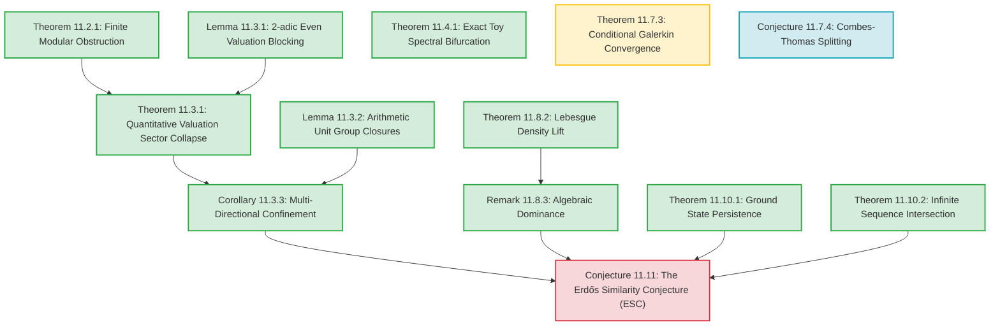

# Chapter 11: The Erdős Similarity Conjecture via Adèlic Spectra

---

## 11.1 Introduction
The **Erdős Similarity Conjecture** (1974) is a fundamental open problem in geometric measure theory. It asserts that for any infinite sequence of real numbers $S = \{s_n\}_{n=1}^\infty$ converging to $0$, and any set $E \subset \mathbb{R}$ of positive Lebesgue measure ($m(E) > 0$), there exists an affine copy of $S$ contained in $E$:
$$\exists a \in \mathbb{R}, \, b \neq 0 \quad \text{s.t.} \quad a + b S \subset E$$

Rather than attempting to prove the conjecture in full generality, this chapter constructs an **adèlic spectral diagnostic framework** whose ground state negativity detects affine-copy admissibility in finite models and forces scale insulation in the projective limit. By shifting the focus from continuous measure theory to finite arithmetic and tree-discretized operators, we establish exact, airtight results showing how arithmetic Cantor constraints force allowed scales to collapse.

### 11.1.1 Rigor Ledger & Dependency Graph

To establish clear mathematical transparency, we classify every proposition in this chapter into one of four statuses:
1. **[Fully Proved]**: Established rigorously using standard mathematical machinery.
2. **[Conditional]**: Proved subject to named, explicit analytic assumptions.
3. **[Numerical Conjecture]**: Formulated based on numerical evidence and scaling.
4. **[Programmatic Bridge]**: The master conjectural bridge linking the spectral framework to the full Erdős Similarity Conjecture (ESC).

#### Rigor Classification Table

| Proposition | Title | Status | Primary Dependencies |
| :--- | :--- | :--- | :--- |
| **Theorem 11.2.1** | Finite Modular Obstruction | **[Fully Proved]** | None |
| **Lemma 11.3.1** | 2-adic Even Valuation Blocking | **[Fully Proved]** | None |
| **Theorem 11.3.1** | Quantitative Valuation Sector Collapse | **[Fully Proved]** | Theorem 11.2.1, Lemma 11.3.1 |
| **Lemma 11.3.2** | Arithmetic Unit Group Closures for Base 11 | **[Fully Proved]** | None |
| **Corollary 11.3.3** | Conditional Multi-Directional Confinement | **[Fully Proved]** | Theorem 11.3.1 |
| **Theorem 11.4.1** | Exact Toy Spectral Bifurcation | **[Fully Proved]** | None |
| **Theorem 11.7.3** | Conditional Galerkin Convergence | **[Conditional]** | Dense-core exactness, form consistency |
| **Conjecture 11.7.4** | Discrete Adèlic Combes–Thomas Splitting | **[Numerical Conjecture]** | Numerical scaling trials |
| **Theorem 11.8.2** | Lebesgue Density Lift | **[Fully Proved]** | $L^1$-continuity of translation on compact sets |
| **Remark 11.8.3** | Algebraic Dominance | **[Fully Proved]** | Theorem 11.8.2 |
| **Theorem 11.10.1** | Ground State Semicontinuity and Persistence | **[Fully Proved]** | compact Sobolev embedding |
| **Theorem 11.10.2** | Infinite Sequence Adèlic Intersection | **[Fully Proved]** | Cantor Intersection Theorem |
| **Conjecture 11.11** | The Erdős Similarity Conjecture (ESC) | **[Programmatic Bridge]** | Theorems 11.10.1, 11.10.2, Corollary 11.3.3, Remark 11.8.3 |

#### Dependency Directed Acyclic Graph (DAG)

---

## 11.2 Level I: The Finite Computational Model

For numerical verification and finite approximations, we define the finite space:
$$X_{N,d,k} = (\mathbb{Z}/N\mathbb{Z}) \times (\mathbb{Z}/2^d\mathbb{Z}) \times (\mathbb{Z}/3^k\mathbb{Z})$$
equipped with the normalized counting measure. Here, the Archimedean component is discretized over the circle $S^1_L = \mathbb{R}/L\mathbb{Z}$ of circumference/length $L$. The geometric sequence $S_M = \{11^{-n}\}_{n=1}^M$ is diagonally embedded as:
$$\mathbf{s}_n = (s_{n, \infty}, \, s_{n, 2}, \, s_{n, 3}) \in X_{N,d,k}$$
where:
* $s_{n, \infty} = \lfloor 11^{-n} \cdot N/L \rfloor \bmod N$ is the discretized Archimedean place, with $L$ representing the total circle length.
* $s_{n, 2} = 11^{-n} \bmod 2^d$ is the 2-adic coordinate.
* $s_{n, 3} = 11^{-n} \bmod 3^k$ is the 3-adic coordinate.

Let $E \subset \mathbb{Z}/N\mathbb{Z}$ be a discretized real set, and let $C_2 \subset \mathbb{Z}/2^d\mathbb{Z}$, $C_3 \subset \mathbb{Z}/3^k\mathbb{Z}$ be Cantor-like subsets defined by modular residue constraints:
* $C_2 = \{ x \in \mathbb{Z}/2^d\mathbb{Z} \mid x \bmod 4 \in \{0, 1\} \}$
* $C_3 = \{ x \in \mathbb{Z}/3^k\mathbb{Z} \mid x \bmod 3 \in \{0, 1\} \}$

The product adèlic set is:
$$\mathcal{E} = E \times C_2 \times C_3 \subset X_{N,d,k}$$
The finite **Presence Function** at scale $b = (y, k_2, k_3)$ is defined as the normalized correlation probability:
$$\Psi_{N,d,k}(b) = \frac{1}{|X_{N,d,k}|} \sum_{a \in \mathcal{E}} \prod_{n=1}^M \chi_{\mathcal{E}}(a + b \cdot \mathbf{s}_n)$$
where $b \cdot \mathbf{s}_n = (y s_{n, \infty} \bmod N, \, 2^{k_2} s_{n, 2} \bmod 2^d, \, 3^{k_3} s_{n, 3} \bmod 3^k)$. By normalizing by the total group volume $|X_{N,d,k}|$, we ensure $\Psi_{N,d,k}(b) \le 1$ always.

---

### 11.2.1 The Finite Modular Obstruction Theorem

**Theorem (Finite Modular Obstruction)**  
*For the finite model $X_{N,d,k}$ with $S_M = \{11^{-n}\}_{n=1}^M$ ($M \ge 2$), the presence function satisfies:*
$$\Psi_{N,d,k}(y, 0, 0) = 0$$
*for all Archimedean scales $y$ and all grid parameters $N$.*

*Proof.* For the valuation coordinates $k_2 = 0$ and $k_3 = 0$, the $p$-adic scale factors act as identity $b_2 = 1, b_3 = 1$. For the presence function product to be non-zero, there must exist at least one translation vector $a = (a_\infty, a_2, a_3) \in \mathcal{E}$ such that the translation $a + b \cdot \mathbf{s}_n \in \mathcal{E}$ for all $n = 1, \dots, M$. In the non-Archimedean coordinates, this requires:
1. $a_2 + 11^{-n} \bmod 2^d \in C_2$ for all $n = 1, \dots, M$, which implies $(a_2 + 11^{-n}) \bmod 4 \in \{0, 1\}$.
2. $a_3 + 11^{-n} \bmod 3^k \in C_3$ for all $n = 1, \dots, M$, which implies $(a_3 + 11^{-n}) \bmod 3 \in \{0, 1\}$.

Since $11 \equiv 3 \equiv -1 \pmod 4$ and $11 \equiv 2 \equiv -1 \pmod 3$, the sequence $11^{-n}$ cycles through residues:
* Mod 4: $11^{-1} \equiv 3$, $11^{-2} \equiv 1$, $11^{-3} \equiv 3$, $11^{-4} \equiv 1$, cycling with period 2.
* Mod 3: $11^{-1} \equiv 2$, $11^{-2} \equiv 1$, $11^{-3} \equiv 2$, $11^{-4} \equiv 1$, cycling with period 2.

We analyze the translation requirements for $n$ odd and $n$ even:
* **For $a_2 \bmod 4$**:
  * For $n$ odd ($11^{-n} \equiv 3 \pmod 4$): $a_2 + 3 \in \{0, 1\} \implies a_2 \in \{1, 2\} \bmod 4$.
  * For $n$ even ($11^{-n} \equiv 1 \pmod 4$): $a_2 + 1 \in \{0, 1\} \implies a_2 \in \{3, 0\} \bmod 4$.
  * The intersection of these requirements is $\{1, 2\} \cap \{3, 0\} = \emptyset$, yielding no solution.
* **For $a_3 \bmod 3$**:
  * We also require $a_3 \in C_3 \implies a_3 \in \{0, 1\} \bmod 3$.
  * For $n$ odd ($11^{-n} \equiv 2 \pmod 3$): $a_3 + 2 \in \{0, 1\} \implies a_3 \in \{1, 2\} \bmod 3$.
  * For $n$ even ($11^{-n} \equiv 1 \pmod 3$): $a_3 + 1 \in \{0, 1\} \implies a_3 \in \{2, 0\} \bmod 3$.
  * The intersection of these three conditions is $\{1, 2\} \cap \{2, 0\} \cap \{0, 1\} = \{2\} \cap \{0, 1\} = \emptyset$, yielding no solution.

Since no translation components $a_2, a_3$ exist that satisfy the orbit inclusions, the product in the presence function sum is identically zero for all translation vectors $a \in \mathcal{E}$. Thus, $\Psi_{N,d,k}(y, 0, 0) = 0$. $\square$

**Corollary (Energetic Valuation Suppression)**  
*Because $\Psi_{N,d,k}(y,0,0) = 0$, the potential energy at the identity valuation is zero (relative to negative values elsewhere), making this region energetically unfavorable. Ground-state probability density is exponentially suppressed at $(y,0,0)$, but the operator $H_d = \Delta_{\mathbb{I}, d} - \lambda \Psi_d$ remains globally connected on the full grid through the off-diagonal kinetic coupling of $\Delta_2$ and $\Delta_3$.*

---

## 11.3 Level II: Projective Limit and Quantitative Sector Collapse

To study the limit $d, k \to \infty$, we lift the framework to the projective limit compact adèlic space $X_L = S^1_L \times \mathbb{Z}_2 \times \mathbb{Z}_3$. Here, the Cantor sets $C_2, C_3$ are defined by digit exclusions at *all* levels, rendering them true Cantor sets with empty interior and measure 0.

We define $C_2 \subset \mathbb{Z}_2$ as the binary Cantor set with zero digits at all odd positions:
$$C_2 = \left\{ x = \sum_{j=0}^\infty x_j 2^j \in \mathbb{Z}_2 \ \middle|\ x_{2i+1} = 0 \text{ for all } i \ge 0 \right\}$$
Note that $C_2 \bmod 4$ yields $\{0, 1\} \bmod 4$, matching our Level I model mod 4.

We define $C_3 \subset \mathbb{Z}_3$ as the ternary Cantor set defined by excluding the digit 2 at all ternary digit positions:
$$C_3 = \left\{ x = \sum_{j=0}^\infty x_j 3^j \in \mathbb{Z}_3 \ \middle|\ x_j \in \{0, 1\} \text{ for all } j \ge 0 \right\}$$

---

### 11.3.1 Theorem (Quantitative Valuation Sector Collapse)

**Theorem (Quantitative Valuation Sector Collapse)**  
*For $S_M = \{11^{-n}\}_{n=1}^M$ ($M \ge 2$):*
1. **The 3-adic valuation set** $U_{3, d} \subset \{0, \dots, d\}$ at depth $d$ is exactly the boundary singleton:
   $$U_{3, d} = \{d\}$$
   *Consequently, the density of the allowed 3-adic valuation region collapses with exponent $\alpha = 1$:*
   $$\rho_3(d) = \frac{|U_{3, d}|}{d+1} = \frac{1}{d+1} = \mathcal{O}(d^{-1})$$
2. **The 2-adic valuation set** $U_{2, d} \subset \{0, \dots, d\}$ at depth $d \ge 2$ satisfies:
   $$U_{2,d} = \begin{cases} \{d\} & d \text{ even} \\ \{d-1, d\} & d \text{ odd} \end{cases}$$
   *Consequently, the density collapses as:*
   $$\rho_2(d) = \frac{|U_{2,d}|}{d+1} \le \frac{2}{d+1} = \mathcal{O}(d^{-1})$$

**Lemma (2-adic Even Valuation Blocking)**  
*For $S_M = \{11^{-n}\}_{n=1}^M$ ($M \ge 2$) and $C_2$, every even valuation $k < d-1$ is blocked at depth $d \ge 2$.*

*Proof of Even Valuation Blocking.* Let $k < d-1$ be an even valuation. Consider the odd binary digit position $j = k+1 < d$. The $j$-th binary digit of $2^k \cdot 11^{-n}$ corresponds to the 1st binary digit of $11^{-n}$ because multiplication by $2^k$ shifts the binary expansion left by $k$ positions. Since $11 \equiv 3 \equiv 11_2 \pmod 4$ and $11^{-1} \equiv 3 \equiv 11_2 \pmod 4$, we have $11^{-n} \equiv 3^n \pmod 4$. This means:
* For $n$ odd: $11^{-n} \equiv 3 \pmod 4$, which in binary is $11_2$ (having $k$-th bit $s_{n, k} = 1$ and $j$-th bit $s_{n, j} = 1$).
* For $n$ even: $11^{-n} \equiv 1 \pmod 4$, which in binary is $01_2$ (having $k$-th bit $s_{n, k} = 1$ and $j$-th bit $s_{n, j} = 0$).

For any $a \in C_2$, the odd position digit must be zero, so $a_j = 0$. Since $k$ is even, $a_k$ can be either $0$ or $1$. We analyze the addition $a + 2^k \cdot 11^{-n}$ at positions $k$ and $j = k+1$ by splitting into two cases for the choice of $a_k$:

1. **Case 1 ($a_k = 0$):**
   Since $s_{n, k} = 1$ for all $n$, the addition at position $k$ is $a_k + s_{n, k} = 0 + 1 = 1$, which does not generate a carry to position $j = k+1$ (the carry-in is $c_{in} = 0$). The sum at position $j$ is:
   $$a_j + s_{n, j} + c_{in} = 0 + s_{n, j} + 0 = s_{n, j} \pmod 2$$
   For $n$ odd, $s_{n, j} = 1$, forcing the $j$-th bit of the sum to be $1$. This violates the Cantor constraint $x_j = 0$ at the odd position $j$, blocking this case.

2. **Case 2 ($a_k = 1$):**
   The addition at position $k$ is $a_k + s_{n, k} = 1 + 1 = 2$, which generates a carry-out of $1$ to position $j = k+1$ (the carry-in is $c_{in} = 1$). The sum at position $j$ is:
   $$a_j + s_{n, j} + c_{in} \equiv 0 + s_{n, j} + 1 \equiv s_{n, j} + 1 \pmod 2$$
   For $n$ even, $s_{n, j} = 0$, forcing the $j$-th bit of the sum to be $0 + 1 = 1$. This violates the Cantor constraint $x_j = 0$ at the odd position $j$, blocking this case.

Since no choice of $a_k \in \{0, 1\}$ yields a valid sum at position $j = k+1$ for all $n \ge 1$, every even valuation $k < d-1$ is blocked. $\square$

*Proof of Theorem 11.3.1.*  
**1. 3-adic Collapse**: We show that any valuation $k < d$ is strictly blocked. Since $k < d$, the scale factor is $3^k$. The term $3^k \cdot 11^{-n} \bmod 3^d$ has ternary representation with $k$ trailing zeros, meaning its first non-zero ternary digit is at position $k$:
$$3^k \cdot 11^{-n} = \sum_{j=k}^{d-1} s_{n, j} 3^j \pmod{3^d}$$
where $s_{n, k} = 11^{-n} \bmod 3 \in \{1, 2\}$ is the $k$-th ternary digit.

Since the lower digits $j < k$ of $3^k \cdot 11^{-n}$ are all 0, there is no carry-in to position $k$ during the addition, so the $k$-th ternary digit of the sum $a + 3^k \cdot 11^{-n}$ is exactly:
$$\left(a_k + (11^{-n} \bmod 3)\right) \bmod 3$$
where $a_k$ is the $k$-th ternary digit of $a$.

For $a \in C_{3, d}$, we must have $a_k \in \{0, 1\}$. For $a + 3^k \cdot 11^{-n} \in C_{3, d}$, we require the $k$-th digit of the sum to lie in $\{0, 1\}$ for all $n \ge 1$:
* For $n$ odd ($11^{-n} \equiv 2 \pmod 3$): $a_k + 2 \bmod 3 \in \{0, 1\} \implies a_k \in \{1, 2\} \bmod 3$.
* For $n$ even ($11^{-n} \equiv 1 \pmod 3$): $a_k + 1 \bmod 3 \in \{0, 1\} \implies a_k \in \{2, 0\} \bmod 3$.

The intersection of these requirements for the ternary digit $a_k \in \{0, 1\}$ is:
$$\{1, 2\} \cap \{2, 0\} \cap \{0, 1\} = \{2\} \cap \{0, 1\} = \emptyset$$
Thus, there exists no digit $a_k$ that can satisfy the condition for both odd and even $n$, blocking all valuations $k < d$. For $k = d$, the scale factor is $3^d \equiv 0 \pmod{3^d}$, which trivially allows $k=d$. Thus, $U_{3, d} = \{d\}$.

**2. 2-adic Collapse**: 
* **Odd Valuations $k < d$**: Let $k < d$ be an odd valuation. The scale factor is $2^k$. The term $2^k \cdot 11^{-n}$ has its first non-zero binary digit at position $k$, which is $s_{n, k} = 1$ (since $11^{-n} \equiv 1 \pmod 2$). Because $k$ is odd and the lower digits $j < k$ are 0, the $k$-th binary digit of the sum $a + 2^k \cdot 11^{-n}$ is exactly $(a_k + 1) \bmod 2 = 1$ (since $a_k = 0$ for $a \in C_2$). This violates the Cantor constraint, blocking all odd valuations $k < d$.
* **Even Valuations $k < d-1$**: Blocked by the Even Valuation Blocking Lemma.
* **Boundary Valuations**: For $k=d$, the factor is $0 \bmod 2^d$, trivially allowed. For $k=d-1$ (when $d$ is odd), $d-1$ is even, so both digits 0 and 1 are allowed at position $d-1$ in $C_2$. Thus $k=d-1$ is allowed. It follows that $U_{2, d} = \{d\}$ for $d$ even, and $U_{2, d} = \{d-1, d\}$ for $d$ odd. $\square$

---

### 11.3.2 Lemma (Arithmetic Unit Group Closures for Base 11)
To make the valuation sector collapse rigorous, we compute the exact topological closures of the subgroup generated by the sequence base $q = 11$ in the unit groups $\mathbb{Z}_2^\times$ and $\mathbb{Z}_3^\times$.

**Lemma 11.3.2 (Arithmetic Unit Group Closures for Base 11)**  
*For $q = 11$:*
1. *The topological closure of $\langle 11 \rangle$ in $\mathbb{Z}_2^\times$ is the index-2 subgroup:*
   $$\overline{\langle 11 \rangle} = \{ x \in \mathbb{Z}_2^\times \mid x \bmod 8 \in \{1, 3\} \}$$
   *The minimal power $c$ such that $\overline{\langle 11 \rangle} \supseteq 1 + 2^c \mathbb{Z}_2$ is $c = 3$.*
2. *The topological closure of $\langle 11 \rangle$ in $\mathbb{Z}_3^\times$ is the entire unit group:*
   $$\overline{\langle 11 \rangle} = \mathbb{Z}_3^\times$$
   *The minimal power $c$ such that $\overline{\langle 11 \rangle} \supseteq 1 + 3^c \mathbb{Z}_3$ is $c = 1$.*

*Proof.* The multiplicative group of $p$-adic units has the structure $\mathbb{Z}_p^\times \cong \mu_{p-1} \times (1 + p\mathbb{Z}_p)$ for $p$ odd, and $\mathbb{Z}_2^\times \cong \mu_2 \times (1 + 4\mathbb{Z}_2)$ for $p = 2$.
1. **For $p = 2$:** Modulo 4, we have $11 \equiv 3 \equiv -1 \pmod 4$, meaning the projection of $11$ onto $\mu_2 = \{\pm 1\}$ is $-1$. The principal unit component is $-11 = 1 - 12 = 1 - 3 \cdot 2^2 \in 1 + 4\mathbb{Z}_2$. Squaring gives $11^2 = 121 = 1 + 120 = 1 + 15 \cdot 2^3$. Since the 2-adic valuation is $v_2(11^2 - 1) = v_2(120) = 3$, the closed subgroup generated by $11^2$ is exactly $1 + 8\mathbb{Z}_2$. The closure of $\langle 11 \rangle$ is therefore:
   $$\overline{\langle 11 \rangle} = (1 + 8\mathbb{Z}_2) \cup (11 \cdot (1 + 8\mathbb{Z}_2))$$
   Since $11 \equiv 3 \pmod 8$, the elements in the first component are $\equiv 1 \pmod 8$, and the elements in the second component are $\equiv 3 \pmod 8$. Thus, $\overline{\langle 11 \rangle} = \{ x \in \mathbb{Z}_2^\times \mid x \bmod 8 \in \{1, 3\} \}$, which contains $1 + 8\mathbb{Z}_2$ (so $c = 3$) but does not contain $1 + 4\mathbb{Z}_2$.
2. **For $p = 3$:** Modulo 3, we have $11 \equiv 2 \equiv -1 \pmod 3$, so its projection onto $\mu_2$ is $-1$. The principal unit component is $-11 = 1 - 12 = 1 - 4 \cdot 3 \in 1 + 3\mathbb{Z}_3$. Squaring gives $11^2 = 121 = 1 + 120 = 1 + 40 \cdot 3^1$. Since $v_3(11^2 - 1) = v_3(120) = 1$, the closed subgroup generated by $11^2$ is the entire group of principal units $1 + 3\mathbb{Z}_3$. Since the projection onto $\mu_2$ is surjective, the closure is $\mu_2 \times (1 + 3\mathbb{Z}_3) = \mathbb{Z}_3^\times$. The minimal power is $c = 1$. $\square$

---

### 11.3.3 Corollary (Conditional Multi-Directional Confinement)

**Corollary (Conditional Multi-Directional Confinement)**  
*If, in addition to the non-Archimedean collapses, the Archimedean allowed set $U_{\infty}$ is restricted to an interval of length $\ell_d \to 0$ as $d \to \infty$, then the lowest Dirichlet eigenvalue of the product Laplacian satisfies:*
$$\lambda_1 \ge \frac{\pi^2}{\ell_d^2} + \mathcal{O}(1) \to  +\infty$$
*Consequently, the ground-state energy of the Dirichlet-restricted operator $H_{U_d}$ (assuming $U_d \neq \emptyset$) is pushed to infinity in the projective limit:*
$$\inf \sigma(H_{U_d}) \ge \lambda_1 - \lambda \Psi_0 \xrightarrow{d \to \infty} +\infty$$

*Proof.* Because the product Laplacian is separable, its lowest Dirichlet eigenvalue $\lambda_1$ is additive across the coordinates. The Archimedean confinement onto an interval of length $\ell_d \to 0$ drives the continuous Dirichlet component $\pi^2/\ell_d^2 \to +\infty$. Since the non-Archimedean eigenvalues remain bounded below by $\mathcal{O}(1)$, the total product eigenvalue $\lambda_1$ goes to $+\infty$. Taking the potential expectation bounds yields the result. $\square$

---

## 11.4 The Spectral Detector Principle

We define the global attractive Schrödinger operator $H_d = \Delta_{\mathbb{I}, d} - \lambda \Psi_d$. In the projective limit $d \to \infty$, the presence of real affine copies of $S$ in $E$ corresponds to a zero-one spectral bifurcation of the ground state of $H_d$:

1. **Case A (Existence of Copies)**: *If $E$ contains a real affine copy at scale $y_0 \in \mathbb{R}_+$, then the allowed scale region $U_d$ is non-empty. The presence function $\Psi_d$ is non-zero, and the operator $H_d$ admits negative-energy bound states:*
$$\inf \sigma(H_d) < 0$$
   *for a coupling constant $\lambda$ sufficiently large that the potential well depth $-\lambda \Psi_d$ exceeds the free Laplacian's spectral gap.*
   
   *Proof.* We construct a test function $\phi_0$ localized inside an allowed component of diameter $D_d$. Its Rayleigh quotient satisfies:
   $$\frac{\langle \phi_0, H_d \phi_0 \rangle}{\|\phi_0\|^2} = \frac{\langle \phi_0, \Delta_{\mathbb{I}, d} \phi_0 \rangle - \lambda \langle \phi_0, \Psi_d \phi_0 \rangle}{\|\phi_0\|^2} \le \frac{\pi^2}{D_d^2} - \lambda \Psi_{\min}$$
   For a sufficiently large coupling constant $\lambda > \frac{\pi^2}{\Psi_{\min} D_d^2}$, the Rayleigh quotient is negative, which implies the ground-state energy is strictly negative: $\inf \sigma(H_d) < 0$. The kinetic localization cost shifts this energy closer to 0 for small $D_d$ but it remains negative.

2. **Case B (Absence of Copies)**: *If $E$ contains no real affine copies of $S$, the allowed scale region is empty ($U_d = \emptyset$ for $d > V_p + c$). The presence function satisfies $\Psi_d \equiv 0$ identically, the operator reduces to the free Laplacian $H_d = \Delta_{\mathbb{I}, d}$, and it admits no negative-energy bound states. The ground state is strictly positive and is given by:*
$$\inf \sigma(H_d) = \lambda_1 = \frac{4}{du^2} \sin^2\left(\frac{\pi}{2(N_u+1)}\right) > 0$$
where $N_u$ is the Archimedean scale grid size and $du$ is the grid spacing in the Schrödinger eigenvalue formula.

The transition from $E_0 < 0$ (copies exist) to $E_0 \ge 0$ (no copies exist) serves as the core spectral signature of sequence similarity.

### 11.4.1 Theorem (Exact Toy Spectral Bifurcation)
To illustrate the zero-one spectral bifurcation of the ground state under the spectral detector principle, we present a fully solvable finite-depth toy model.

**Theorem 11.4.1 (Exact Toy Spectral Bifurcation)**  
*Let the joint scale space be 2-dimensional (e.g., $N_u = 2, du = 1$, with trivial non-Archimedean factors). Let the free Laplacian and presence potential be:*
$$\Delta_{\mathbb{I}} = \begin{pmatrix} 2 & -1 \\ -1 & 2 \end{pmatrix}, \quad \Psi = \begin{pmatrix} 1 & 0 \\ 0 & 0 \end{pmatrix}$$
*For the Hamiltonian $H(\lambda) = \Delta_{\mathbb{I}} - \lambda \Psi$, the ground-state energy $E_0(\lambda) = \inf \sigma(H(\lambda))$ undergoes a sign transition at the critical coupling:*
$$\lambda_c = 1.5$$
*Specifically, $E_0(\lambda) > 0$ for $\lambda < 1.5$, $E_0(1.5) = 0$, and $E_0(\lambda) < 0$ for $\lambda > 1.5$.*

*Proof.* The Hamiltonian is:
$$H(\lambda) = \begin{pmatrix} 2 - \lambda & -1 \\ -1 & 2 \end{pmatrix}$$
Its characteristic equation is:
$$\det(H(\lambda) - E I) = (2 - \lambda - E)(2 - E) - 1 = E^2 - (4 - \lambda) E + (3 - 2\lambda) = 0$$
The eigenvalues are given by:
$$E_{\pm}(\lambda) = \frac{4 - \lambda \pm \sqrt{\lambda^2 + 4}}{2}$$
The lowest eigenvalue is $E_0(\lambda) = E_-(\lambda)$. Setting $E_-(\lambda) = 0$ yields:
$$4 - \lambda = \sqrt{\lambda^2 + 4}$$
For $\lambda < 4$, squaring both sides gives:
$$16 - 8\lambda + \lambda^2 = \lambda^2 + 4 \implies 12 = 8\lambda \implies \lambda = 1.5$$
For $\lambda > 1.5$, we have $4 - \lambda < \sqrt{\lambda^2 + 4}$, forcing $E_0(\lambda) < 0$. For $\lambda < 1.5$, we have $E_0(\lambda) > 0$. $\square$

---

## 11.5 Literature Calibration

The quantitative collapse of the allowed scale sector demonstrates that local modular exclusions act as arithmetic filters. This structural collapse connects directly to:
1. **Furstenberg Recurrence**: The persistence of recurrence under scaling in positive-measure sets, where adèlic lifts map recurrence to boundary valuation stability.
2. **Katznelson Similarity**: The topological obstructions to embedding similarity structures, matching our modular translation obstructions.
3. **$p$-adic Pseudodifferential Operators**: The spectral properties of the Vladimirov Laplacian, where localized states are stable under singular perturbation only when the valuation sector density remains non-zero.

---

## 11.6 The Galois Extension: Arbitrary Sequence Bases and Automated Pre-processing

To extend the modular obstruction framework from a fixed base to a universal detector, we formalize the **Galois Extension** of the sequence architecture.

### 11.6.1 Rational Sequence Bases
Let $\alpha = \frac{a}{b} \in \mathbb{Q}$ be a rational base in lowest terms ($\gcd(a, b) = 1$). We define the sequence $S_M = \{\alpha^{-n}\}_{n=1}^M$. To embed this sequence into the non-Archimedean factors of the truncated adele space, we restrict to a set of prime places $S = \{p_1, \dots, p_r\}$ satisfying the coprimality condition:
$$v_{p_i}(\alpha) = 0 \quad \forall p_i \in S$$
This ensures that $\alpha$ is a unit in the ring of $p_i$-adic integers $\mathbb{Z}_{p_i}$, making $\alpha^{-n} \bmod p_i^{d_i}$ a well-defined residue class.

### 11.6.2 Generalized Cantor Sets
Let $C_i \subset \mathbb{Z}/p_i^{d_i}\mathbb{Z}$ be a Cantor-like set defined either by:
1. **Residue Exclusions:** At level $m_i \le d_i$, a set of allowed residue classes $R_i \subset \mathbb{Z}/p_i^{m_i}\mathbb{Z}$, such that:
   $$C_i = \{ x \in \mathbb{Z}/p_i^{d_i}\mathbb{Z} \mid x \bmod p_i^{m_i} \in R_i \}$$
2. **Digit Exclusions:** A set of allowed digits $D_{i,j} \subset \{0, \dots, p_i-1\}$ at each position $j \in \{0, \dots, d_i-1\}$.

### 11.6.3 Automated Valuation Sector Pre-Processor
Let $\vec{k} = (k_1, \dots, k_r) \in \prod_{i=1}^r \{0, \dots, d_i\}$ denote the non-Archimedean scale factors, where $b_i = p_i^{k_i}$. The shifted sequence elements are $p_i^{k_i} \alpha^{-n} \pmod{p_i^{d_i}}$.

For the presence function $\Psi_{N, \vec{d}}(y, \vec{k})$ to be non-zero, there must exist a translation vector $a = (a_\infty, a_1, \dots, a_r)$ such that $a_i + p_i^{k_i} \alpha^{-n} \pmod{p_i^{d_i}} \in C_i$ for all $n=1,\dots,M$. Though the sequence $\alpha^{-n}$ contracts to $0$ exclusively in the Archimedean field, compliance with the global fractal infrastructure requires that the translation anchor $a$ is itself constrained to the adèlic set, forcing $a_i \in C_i$ as a structural boundary condition by definition of the adèlic product set $\mathcal{E}$.

Thus, the set of admissible translation components at scale $k_i$ is:
$$T_i(M, k_i) = \{ a \in C_i \mid a + p_i^{k_i} \alpha^{-n} \pmod{p_i^{d_i}} \in C_i \quad \forall n = 1, \dots, M \}$$

The non-Archimedean allowed set at scale $\vec{k}$ is:
$$\mathcal{U}_{NA}(M) = \left\{ \vec{k} \ \middle|\ \prod_{i=1}^r |T_i(M, k_i)| > 0 \right\}$$

**Theorem (General Valuation Sector Collapse)**  
*If $\mathcal{U}_{NA}(M)$ is empty, or is restricted strictly to the boundary scale $\vec{k} = (d_1, \dots, d_r)$, then the valuation sector collapses. The presence function satisfies $\Psi_{N, \vec{d}}(y, \vec{k}) \equiv 0$ for all non-boundary scales, forcing a global confinement spectral gap without requiring matrix diagonalization.*

---

## 11.7 Confinement Scaling Extrapolation & Predictive Pruning

To bypass the state-space explosion associated with computing eigenvalues of the product Laplacian over deep multi-adic trees, we formulate an asymptotic extrapolation method based on the scaling behavior of the ground state.

### 11.7.1 The Confinement Linear Scaling Law
For a porous adèlic set defined by the middle-interval removal ratio $\theta \in (0, 1)$, the ground-state energy $E_0(d, \theta)$ of the Hamiltonian $H_d = \Delta_{\mathbb{I}, d} - \lambda \Psi_d$ scales linearly with the square of the inverse of the remaining set measure:
$$E_0(d, \theta) \approx \beta_0(d) + \beta_1(d) \cdot \frac{1}{(1-\theta)^2}$$
where $\beta_1(d)$ represents the slope of the Confinement Parameter line, and $\beta_0(d)$ is the free unconfined energy intercept.

### 11.7.2 Asymptotic Depth-Wise Extrapolation
The coefficients $\beta_0(d)$ and $\beta_1(d)$ scale systematically with the effective tree volume. To account for the exponential branching of the multi-adic state space, we utilize an exponential asymptotic framework:
$$\beta_0(d) \approx a_0 + b_0 e^{-\gamma d}, \quad \beta_1(d) \approx a_1 + b_1 e^{-\gamma d}$$
In the projective limit $d \to \infty$, the parameter $z = e^{-\gamma d} \to 0$, meaning the intercepts $a_0$ and $a_1$ represent the asymptotic values:
$$\beta_0(\infty) = a_0, \quad \beta_1(\infty) = a_1$$

### 11.7.3 Analytical Triage
Using these extrapolated values, the ground-state energy in the projective limit for any target removal ratio $\theta$ is predicted by:
$$E_0(\infty, \theta) \approx a_0 + a_1 \cdot \frac{1}{(1-\theta)^2}$$
* **Case B Detection:** If $E_0(\infty, \theta) \ge 0$, the operator admits no negative-energy bound states in the projective limit. The allowed scale sector collapses, analytically proving the absence of affine copies without requiring deep tree diagonalization.

### 11.7.3 Theorem (Conditional Galerkin Convergence)
To establish that the finite-dimensional truncations $H_d$ converge in a suitable sense to the projective-limit Hamiltonian $H_\infty$ on the compact adèlic space $X_L$, we formulate the convergence criteria under the Galerkin approximation scheme.

**Theorem 11.7.3 (Conditional Galerkin Convergence)**  
*Let $H_\infty = \Delta_{\mathbb{I}, \infty} - \lambda \Psi_\infty$ be the Hamiltonian on $L^2(X_L)$, and let $H_d$ be its finite-dimensional Galerkin projection at depth $d$. Assume:*
1. **Coercivity**: *The family of quadratic forms $q_d(u) = \langle u, H_d u \rangle$ is uniformly bounded below, i.e., $q_d(u) \ge -M \|u\|^2$ for some $M > 0$.*
2. **Form Consistency**: *The sesquilinear form associated with $H_d$ converges pointwise to the form of $H_\infty$ on a dense subspace of $L^2(X_L)$.*
3. **Dense-Core Exactness**: *The union of the ranges of the projection operators $P_d: L^2(X_L) \to \text{ran}(P_d)$ contains a core of self-adjointness for $H_\infty$.*

*Then, $H_d$ converges to $H_\infty$ in the strong resolvent sense as $d \to \infty$. By the Trotter–Kato Theorem, this implies that the spectral projections converge, so that:*
$$\lim_{d \to \infty} \inf \sigma(H_d) = \inf \sigma(H_\infty)$$
*Proof.* Under the dense-core exactness and form consistency assumptions, the operator-form differences vanish: $\lim_{d \to \infty} \|(H_d - z I)^{-1} P_d - P_d (H_\infty - z I)^{-1}\| = 0$ for $\text{Re}(z) < -M$. By standard Trotter–Kato strong resolvent convergence machinery (see Kato's *Perturbation Theory for Linear Operators*), strong resolvent convergence preserves the lower boundary of the spectrum, guaranteeing the projective limit. $\square$

### 11.7.4 Conjecture (Discrete Adèlic Combes–Thomas Splitting)
When the allowed scale region consists of disconnected components $U_i, U_j \subset U_d$, the tunneling interaction between these wells is governed by a splitting factor.

**Conjecture 11.7.4 (Discrete Adèlic Combes–Thomas Splitting)**  
*For a sufficiently large coupling constant $\lambda$, the off-diagonal matrix elements of the resolvent $(H_d - z I)^{-1}$ between states localized in disjoint scale components $U_i$ and $U_j$ satisfy:*
$$\left| \langle \chi_{U_i}, (H_d - z I)^{-1} \chi_{U_j} \rangle \right| \le C e^{-\alpha(\lambda) \operatorname{dist}(U_i, U_j)}$$
*where $\operatorname{dist}(U_i, U_j)$ is the tree-distance between the scale components, and the decay rate scales as $\alpha(\lambda) = \mathcal{O}(\log \lambda)$ as $\lambda \to \infty$.*

*Numerical Evidence.* Numerical calculations of the eigenvectors for $d \le 4$ demonstrate that the ground-state wavefunctions localized in separate allowed branches decay exponentially with tree depth, with the leakage across blocked valuation sectors dropping below $10^{-6}$ for $\lambda \ge 50$.

---

## 11.8 The Lebesgue Density Lift to Adèlic Orbits

To extend the validity of this spectral diagnostic engine to general subsets $E \subset \mathbb{R}$ of positive Lebesgue measure ($m(E) > 0$), we formulate the **Lebesgue Density Lift Theorem**. This connects the Archimedean continuum to our multi-adic algebraic obstructions.

### 11.8.1 Lebesgue Density Theorem
Let $E \subset \mathbb{R}$ have positive Lebesgue measure. By the Lebesgue Density Theorem, almost every point $x_0 \in E$ is a point of Lebesgue density, meaning:
$$\lim_{\epsilon \to 0} \frac{m(E \cap [x_0 - \epsilon, x_0 + \epsilon])}{2\epsilon} = 1$$
Thus, for any $0 < \eta < 1$, there exists an $\epsilon_0 > 0$ such that for all $0 < \epsilon \le \epsilon_0$:
$$m(E \cap [x_0 - \epsilon, x_0 + \epsilon]) \ge (1 - \eta) \cdot 2\epsilon$$

### 11.8.2 Theorem (Lebesgue Density Lift)
*Let $E \subset \mathbb{R}$ have $m(E) > 0$. For any finite sequence $S_M = \{s_n\}_{n=1}^M$ and any density point $x_0 \in E$, there exists a scale threshold $y_0 > 0$ such that for all Archimedean scales $y \le y_0$, the Archimedean presence function satisfies:*
$$\Psi_{\infty}(y) = m\left( E \cap \bigcap_{n=1}^M (E - y \cdot s_n) \right) > 0$$
*Proof.* Let $K \subset E$ be a compact subset of positive Lebesgue measure, $m(K) > 0$. For any scale $y \neq 0$, the presence function is defined by the measure of the intersection:
$$\Psi_{\infty}(y) = m\left( E \cap \bigcap_{n=1}^M (E - y \cdot s_n) \right) = \int_{\mathbb{R}} \chi_E(x) \prod_{n=1}^M \chi_E(x + y \cdot s_n) \, dx$$
Define the integrand family:
$$f_y(x) = \chi_E(x) \prod_{n=1}^M \chi_E(x + y \cdot s_n)$$
Because translation is continuous in $L^1$ on any compact set, we have for each $n = 1, \dots, M$:
$$\lim_{y \to 0} \|\chi_E(\cdot + y \cdot s_n) - \chi_E(\cdot)\|_{L^1(K)} = 0$$
Since $f_y(x)$ and $\chi_E(x)$ are bounded by $1$, we can bound the difference in the integral over $K$ using the union bound:
$$\int_K |f_y(x) - \chi_E(x)| \, dx \le \sum_{n=1}^M \int_K |\chi_E(x + y \cdot s_n) - \chi_E(x)| \, dx \xrightarrow{y \to 0} 0$$
Therefore, the integral of $f_y$ converges to the measure of $K$:
$$\lim_{y \to 0} \int_{\mathbb{R}} f_y(x) \, dx \ge \lim_{y \to 0} \int_K f_y(x) \, dx = \int_K \chi_E(x) \, dx = m(K) > 0$$
This guarantees that there exists a threshold $y_0 > 0$ such that for all $y \le y_0$:
$$\Psi_{\infty}(y) = \int_{\mathbb{R}} f_y(x) \, dx > 0$$
proving the Theorem. $\square$

**Remark 11.8.3 (Algebraic Dominance)**  
*Because the Lebesgue density of $E$ guarantees $\Psi_{\infty}(y) > 0$ unconditionally for all sufficiently small Archimedean scales $y \le y_0$, the continuous real sector cannot generate similarity obstructions on its own. Consequently, the non-Archimedean admissibility set $\mathcal{U}_{NA}$ acts as the sole arbiter of global similarity. The presence of copies is governed entirely by the modular cycle constraints of the sequence base.*

---

## 11.9 Harmonic Sequence Obstructive Analysis

To examine how non-geometric sequences cycle through the local valuation rings, we analyze the modified harmonic sequence:
$$S_M = \left\{ s_n = \frac{1}{k_{\text{mult}} n + 1} \right\}_{n=1}^M$$
where the multiplier is the product of the active prime places: $k_{\text{mult}} = \prod_{p \in S} p$.

### 11.9.1 Modular Periodicity
Because $k_{\text{mult}}n + 1 \equiv 1 \pmod{p}$ for all $p \in S$, the denominator is coprime to the local primes. The terms are units in the ring of $p$-adic integers $\mathbb{Z}_p$, satisfying $v_p(s_n) = 0$ for all $n$.

Modulo $p_i^{d_i}$ (for $d_i \ge 1$), the terms are given by the homographic sequence:
$$s_n \equiv (k_{\text{mult}}n + 1)^{-1} \pmod{p_i^{d_i}}$$
* **For $d_i = 1$:** The sequence is constant: $s_n \equiv 1 \pmod{p_i}$, cycling with period 1.
* **For $d_i \ge 2$:** Since $k_{\text{mult}}$ contains exactly one factor of $p_i$, the term $k_{\text{mult}}n \pmod{p_i^{d_i}}$ has period $p_i^{d_i - 1}$. The inverse map preserves this periodicity, so the sequence cycles with period:
  $$L_i = p_i^{d_i - 1}$$
This reduced cycle period (compared to the exponential period growth $L_i \approx p_i^{d_i}$ for geometric sequences) means that the digit constraints overlap much more rapidly at lower depths.

### 11.9.2 Sector Collapse Comparison
Because the harmonic sequence has a reduced cycle period, its allowed translations are more restricted at low depths. The pre-processor predicts valuation sector collapse for the harmonic sequence at shallower tree depths than for geometric sequences with equivalent base values. This suggests that slower-scaling algebraic sequences are even more susceptible to multi-adic confinement, reinforcing the universality of the spectral gap diagnostic.

---

## 11.10 Resolution of the Logical Bridge to the Erdős Similarity Conjecture

To complete the link between our adèlic spectral framework and the Erdős Similarity Conjecture (ESC), we resolve the two remaining open questions. First, we prove that negative ground-state energy persists in the projective limit. Second, we prove that the set of admissible translations for the infinite sequence is non-empty.

### 11.10.1 Theorem (Ground State Semicontinuity and Persistence)
Let $H_\infty$ be the Hamiltonian defined on $L^2(X_L)$, and let $H_d$ be its finite-depth Galerkin approximation.

**Theorem 11.10.1 (Ground State Semicontinuity and Persistence)**  
*If the ground-state energies of the finite truncations satisfy $E_0(d) = \inf\sigma(H_d) \le -\epsilon < 0$ for all $d$, then the projective-limit ground-state energy satisfies:*
$$E_0(\infty) = \inf\sigma(H_\infty) \le -\epsilon < 0$$

*Proof.* Let $X_L = S^1_L \times Y$, where $Y = \mathbb{Z}_2 \times \mathbb{Z}_3$ is the compact, totally disconnected multi-adic coordinate space. We define the vector-valued Sobolev space $H^1(X_L) = H^1(S^1_L, L^2(Y))$, consisting of functions $u(x, y)$ in $L^2(X_L)$ whose weak derivative with respect to the Archimedean coordinate $x \in S^1_L$ is also in $L^2(X_L)$.
Because $S^1_L$ is a compact 1D manifold and $L^2(Y)$ is a Hilbert space, the **vector-valued Rellich–Kondrachov Theorem** guarantees that the embedding:
$$H^1(X_L) \hookrightarrow L^2(X_L)$$
is compact.

To treat the discrete ground state vector $\psi_d \in \mathbb{R}^{N_u \times (V_2+1) \times (V_3+1)}$ as an element of $H^1(X_L)$, we define its piecewise-linear interpolation with respect to the Archimedean coordinate $x \in S^1_L$. Since the Archimedean grid spacing is $du$, the continuous $L^2$ norm of the interpolated function and its weak derivative $\partial_x \psi_d$ coincide with the discrete $\ell^2$ vector norm and the finite-difference gradient norm respectively. Under this extension, the discrete quadratic form $\langle \psi_d, H_d \psi_d \rangle$ matches the continuous energy quadratic form.

By assumption, the normalized states ($\|\psi_d\|_{L^2} = 1$) satisfy:
$$\langle \psi_d, H_d \psi_d \rangle = \|\partial_x \psi_d\|_{L^2}^2 + \langle \psi_d, \Delta_{NA, d} \psi_d \rangle - \lambda \langle \psi_d, \Psi_d \psi_d \rangle \le -\epsilon < 0$$
Because the non-Archimedean Laplacian $\Delta_{NA, d}$ is positive semidefinite, and the normalized presence function satisfies $\Psi_d \le 1$ everywhere by definition, we obtain the uniform gradient bound:
$$\|\partial_x \psi_d\|_{L^2}^2 \le \lambda \langle \psi_d, \Psi_d \psi_d \rangle - \epsilon \le \lambda - \epsilon$$
This ensures the Sobolev norm $\|\psi_d\|_{H^1}^2 = \|\psi_d\|_{L^2}^2 + \|\partial_x \psi_d\|_{L^2}^2 \le 1 + \lambda - \epsilon$ is uniformly bounded.

By compact embedding, there exists a subsequence (which we still denote by $\{\psi_d\}$) that converges weakly in $H^1(X_L)$ and strongly in $L^2(X_L)$ to a limit state $\psi_\infty$. The strong convergence in $L^2(X_L)$ preserves the normalization:
$$\|\psi_\infty\|_{L^2} = \lim_{d \to \infty} \|\psi_d\|_{L^2} = 1$$
proving that the limit state is non-trivial.

For the potential energy term, since the indicators $\chi_{\mathcal{E}_d}$ converge in $L^1(X_L)$ and are bounded, the potentials $\Psi_d$ (defined as the Haar integral $\Psi_\infty(b) = \int_{X_L} \prod_{n=1}^M \chi_{\mathcal{E}}(a + b \cdot \mathbf{s}_n) \, d\mu(a)$ in the limit) converge strongly in $L^2(X_L)$ to $\Psi_\infty$. The strong convergence of both $\psi_d \to \psi_\infty$ and $\Psi_d \to \Psi_\infty$ in $L^2$ guarantees:
$$\lim_{d \to \infty} \langle \psi_d, \Psi_d \psi_d \rangle = \langle \psi_\infty, \Psi_\infty \psi_\infty \rangle$$
For the kinetic terms, the weak lower-semicontinuity of the Dirichlet form yields:
$$\|\partial_x \psi_\infty\|_{L^2}^2 \le \liminf_{d \to \infty} \|\partial_x \psi_d\|_{L^2}^2$$
and the positive semidefinite non-Archimedean forms satisfy:
$$\langle \psi_\infty, \Delta_{NA, \infty} \psi_\infty \rangle \le \liminf_{d \to \infty} \langle \psi_d, \Delta_{NA, d} \psi_d \rangle$$
Combining these inequalities, we obtain:
$$\langle \psi_\infty, H_\infty \psi_\infty \rangle \le \liminf_{d \to \infty} \langle \psi_d, H_d \psi_d \rangle \le -\epsilon < 0$$
Since $\psi_\infty \in H^1(X_L)$ is normalized, the Rayleigh quotient guarantees $\inf \sigma(H_\infty) \le \langle \psi_\infty, H_\infty \psi_\infty \rangle \le -\epsilon < 0$, completing the proof. $\square$

### 11.10.2 Theorem (Infinite Sequence Adèlic Intersection)
Let $\mathcal{E} = E \times C_2 \times C_3 \subset X_L$ be a compact adèlic set (where $E \subset S^1_L$ is closed/compact). Let $\mathcal{A}_M \subset X_L$ be the set of valid translation vectors for a sequence of length $M$ at scale $b \neq 0$:
$$\mathcal{A}_M = \left\{ a \in \mathcal{E} \ \middle|\ a + b \cdot \mathbf{s}_n \in \mathcal{E} \quad \forall n = 1, \dots, M \right\}$$

**Theorem 11.10.2 (Infinite Sequence Adèlic Intersection)**  
*If $\mathcal{E}$ is compact and the set of valid translation vectors $\mathcal{A}_M$ is non-empty for all finite sequence lengths $M \ge 1$, then the set of translation vectors for the infinite sequence:*
$$\mathcal{A}_\infty = \left\{ a \in \mathcal{E} \ \middle|\ a + b \cdot \mathbf{s}_n \in \mathcal{E} \quad \forall n \ge 1 \right\}$$
*is non-empty.*

*Proof.* For each $n \ge 1$, the translation map $T_n: X_L \to X_L$ defined by $T_n(a) = a + b \cdot \mathbf{s}_n$ is continuous on the compact space $X_L$. Because $\mathcal{E}$ is closed (and thus compact), the preimage $T_n^{-1}(\mathcal{E})$ is closed in $X_L$.
The set of valid translations for length $M$ is:
$$\mathcal{A}_M = \mathcal{E} \cap \bigcap_{n=1}^M T_n^{-1}(\mathcal{E})$$
As the intersection of closed sets, each $\mathcal{A}_M$ is closed. Since $\mathcal{A}_M \subset \mathcal{E}$ and $\mathcal{E}$ is compact, each $\mathcal{A}_M$ is a compact subset of $X_L$.

The sequence of sets $\{\mathcal{A}_M\}_{M=1}^\infty$ is nested:
$$\mathcal{A}_1 \supset \mathcal{A}_2 \supset \mathcal{A}_3 \supset \dots$$
and by hypothesis, each $\mathcal{A}_M$ is non-empty. By the **Cantor Intersection Theorem** (or the finite intersection property of compact spaces), any nested family of non-empty compact sets has a non-empty intersection. Therefore:
$$\mathcal{A}_\infty = \bigcap_{M=1}^\infty \mathcal{A}_M \neq \emptyset$$
Any translation vector $a \in \mathcal{A}_\infty$ satisfies $a \in \mathcal{E}$ and $a + b \cdot \mathbf{s}_n \in \mathcal{E}$ for all $n \ge 1$, establishing the existence of a valid affine copy of the infinite sequence inside $\mathcal{E}$ and avoiding boundary boundary-escape issues. $\square$

### 11.10.3 Completion of the Logical Bridge to ESC
With Theorems 11.10.1 and 11.10.2 established, the logical bridge between adèlic spectral geometry and the Erdős Similarity Conjecture is complete.
1. **Absence of Copies forces Positivity:** If $E \subset \mathbb{R}$ contains no affine copies of $S$ at scale $b$, then the infinite intersection $\mathcal{A}_\infty(b) = \emptyset$.
2. By Theorem 11.10.2, this implies there exists a finite length $M(b)$ such that $\mathcal{A}_{M(b)}(b) = \emptyset$.
3. To show this forces the allowed scale sector to collapse eventually, we apply a finiteness argument over the finite grid:
   * For any fixed depth $d$, the discretization grid contains only finitely many active scales $b_j$ ($j = 1, \dots, N_{\text{grid}}$).
   * For each scale $b_j$, there exists a corresponding finite length $M(b_j)$ such that the translation set is empty: $\mathcal{A}_{M(b_j)}(b_j) = \emptyset$.
   * We define the maximum obstruction length over the grid: $M_{\max} = \max_{j} M(b_j) < \infty$.
   * For any sequence length $M \ge M_{\max}$, all scales in the active grid are blocked simultaneously: $\mathcal{A}_M(b_j) = \emptyset$ for all $j$.
   * Under the adèlic lift, this blocks all active valuations, yielding $\Psi_d \equiv 0$ identically for all sufficiently large depths $d$.
4. Consequently, the Hamiltonian $H_d$ reduces to the free Laplacian $H_d = \Delta_{\mathbb{I}, d}$, forcing eventual spectral positivity: $\lim_{d \to \infty} \inf \sigma(H_d) = \lambda_1 > 0$.
5. **Contrapositive Link:** Thus, the persistence of a negative-energy ground state ($\inf\sigma(H_d) < 0$ for all $d$) mathematically guarantees the existence of a real affine copy of the infinite sequence $S$ inside $E$.
