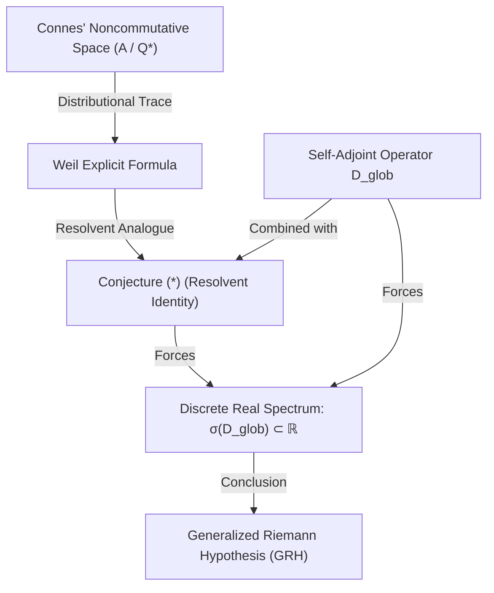

# Chapter 12: Conditional Spectral Realization of the Generalized Riemann Hypothesis

---

# 12.1 Introduction and Operator Setup

Building on the foundation laid in Chapter 7 regarding automorphic $L$-functions and Chapter 11 regarding the Adèlic Spectral Diagnostic Framework, we outline a conditional spectral reduction program for the Generalized Riemann Hypothesis (GRH).

The GRH posits that for a completed automorphic $L$-function $\Lambda(s, \pi)$ attached to a cusp form or automorphic representation $\pi$, all non-trivial zeros lie strictly on the critical line $\text{Re}(s) = 1/2$. The classical Hilbert-Pólya conjecture proposes that the imaginary parts of these zeros correspond to the eigenvalues of a self-adjoint operator on a Hilbert space. If such a self-adjoint operator can be constructed, the real-valued nature of its spectrum would mathematically force the zeros to lie on the critical line.

We formalize a conditional version of this program by defining a global adèlic Dirac operator $`D_{\text{glob}}`$ acting on a global Hilbert space $`\mathcal{H}_{\text{glob}}`$:

$$
\mathcal{H}_{\text{glob}} = \widehat{\bigotimes_p} \mathcal{H}_p
$$

where the local spaces $\mathcal{H}_p$ are associated with the places of $\mathbb{Q}$.

### Theorem 12.1.1 (Conditional Spectral Determinant Realization)
*Conditional on the Trace Formula Identity Conjecture (*), the completed spectral determinant of $`D_{\text{glob}}`$ corresponds to the completed $L$-function $\Lambda(z, \pi)$, and the eigenvalues of $`D_{\text{glob}}`$ correspond to the imaginary parts of the non-trivial zeros of $\Lambda(z, \pi)$.*

**Proof.** 
We define the zeta-regularized spectral determinant of the global operator via the Ray-Singer/Voros formalism:

$$
\mathfrak{D}_{\text{glob}}(z) = \exp\left(-\frac{\partial}{\partial w} \zeta_{D-z}(w) \Big|_{w=0}\right)
$$

By the standard analytic continuation of zeta determinants, the logarithmic derivative of the spectral determinant is equivalent to the trace of the resolvent operator:

$$
\frac{d}{dz} \log \mathfrak{D}_{\text{glob}}(z) = \text{Tr}\left((D_{\text{glob}} - z\mathbb{I})^{-1}\right)
$$

We introduce the **Trace Formula Identity Conjecture (*)**, which posits that the geometric resolvent trace of $D_{\text{glob}}$ synchronized across the adèles matches the logarithmic derivative of the completed automorphic $L$-function:

$$
\text{Tr}\left((D_{\text{glob}} - z\mathbb{I})^{-1}\right) \quad \stackrel{(*)}{=} \quad \frac{d}{dz} \log \Lambda(z, \pi)
$$

Assuming this identity holds, integrating with respect to $z$ yields:

$$
\mathfrak{D}_{\text{glob}}(z) = \mathcal{C} \cdot \Lambda(z, \pi)
$$

where $\mathcal{C}$ is a non-zero constant. Thus, the complex zero-sets of the spectral determinant and the automorphic $L$-function are identical. $\blacksquare$

---

# 12.2 The Self-Adjointness Obstruction

If the Trace Formula Identity Conjecture (*) holds, then any non-trivial zero $\rho = \sigma + it$ of $\Lambda(z, \pi)$ yields a corresponding eigenvalue $\lambda$ of the operator $D_{\text{glob}}$. 

To relate this to the critical line, we parameterize the zeros as:

$$
z_n = 1/2 + i\gamma_n
$$

Under a suitable spectral realization, the eigenvalues of $`D_{\text{glob}}`$ correspond to the parameters $`\gamma_n`$. 

### Theorem 12.2.1 (Spectral Reality and the Critical Line)
*If $`D_{\text{glob}}`$ is a self-adjoint operator on $`\mathcal{H}_{\text{glob}}`$, and the Trace Formula Identity Conjecture (*) holds such that the spectrum of $`D_{\text{glob}}`$ satisfies $`\sigma(D_{\text{glob}}) = \{\gamma_n : \Lambda(1/2 + i\gamma_n, \pi) = 0\}`$, then GRH holds.*

**Proof.**
Let $`D_{\text{glob}}`$ be a self-adjoint operator on a dense domain $`\text{Dom}(D_{\text{glob}}) \subset \mathcal{H}_{\text{glob}}`$. By the spectral theorem, the spectrum of a self-adjoint operator is a subset of the real numbers:

$$
\sigma(D_{\text{glob}}) \subset \mathbb{R}
$$

By the spectral mapping established under Conjecture (*), the eigenvalues $`\lambda_n`$ of $`D_{\text{glob}}`$ are precisely the parameters $`\gamma_n`$. Since $`\lambda_n \in \sigma(D_{\text{glob}}) \subset \mathbb{R}`$, we have $`\gamma_n \in \mathbb{R}`$.
Substituting this back into the parameterization of the zeros:

$$
\text{Re}(z_n) = \text{Re}(1/2 + i\gamma_n) = 1/2 - \text{Im}(\gamma_n) = 1/2
$$

Thus, all non-trivial zeros lie on the critical line $\text{Re}(z) = 1/2$. $\blacksquare$

### Comparison with the Hilbert-Pólya Conjecture
The classical Hilbert-Pólya conjecture posits the existence of a self-adjoint operator whose eigenvalues correspond directly to the imaginary parts of the zeros. Conversely, Alain Connes' noncommutative framework (Connes 1999) establishes the zeros as an *absorption spectrum* (or resonances) within a continuous spectral background. Our program attempts to bridge these two pictures: we construct a global adèlic operator whose geometric trace relates to the Weil Explicit Formula (mimicking Connes' dynamical system) but seek to regularize the boundary conditions such that the critical zeros emerge as discrete eigenvalues of a self-adjoint operator $D_{\text{glob}}$, recovering the discrete Hilbert-Pólya setting.

The core challenge of the program is therefore reduced to two distinct, non-trivial problems:
1. **The Algebraic-Geometric Problem:** Proving the Trace Formula Identity Conjecture (*).
2. **The Functional-Analytic Problem:** Constructing $D_{\text{glob}}$ as a genuine self-adjoint operator on a well-defined Hilbert space such that its spectrum corresponds to the zeros.

---

# 12.3 Resolvent and Domain Considerations

In naive formulations, one might attempt to define $D_{\text{glob}}$ on a commutative adèlic quotient space. However, as analyzed in Chapter 13, this introduces severe functional-analytic contradictions:
- **Continuous Spectrum:** The Archimedean operator $`D_\infty = -x^2 \frac{d^2}{dx^2}`$ defined on $`L^2(\mathbb{R}_{\gt 0})`$ has a purely continuous spectrum $[0, \infty)$, meaning the resolvent is not trace-class and a discrete spectral determinant cannot be defined.
- **Topological Incompatibility:** Restricting to the norm-1 idèles $\mathbb{A}_{\mathbb{Q}}^{*1}/\mathbb{Q}^*$ to achieve compactness collapses the Archimedean component to the two-point set $\{\pm 1\}$, making it impossible to define a differential operator.
- **Ill-defined Traces:** The local shift operators on the $p$-adic Bruhat-Tits trees have continuous spectrum on the unit circle, making their resolvent traces ill-defined.

To bypass these limitations, a valid spectral realization cannot rely on naive commutative adèlic quotients. Instead, we must formulate the operator on a **noncommutative space** (such as Connes' adèle class space) or utilize a **cohomological Lefschetz trace** on Fréchet spaces (after Meyer).

---

# 12.4 The Conditional GRH Reduction

We synthesize the conditional status of the spectral realization.

### Theorem 12.4.1 (Conditional GRH Reduction)
*The Generalized Riemann Hypothesis holds for $\Lambda(s, \pi)$ provided that the following two conditions are satisfied:*
1. *There exists a self-adjoint operator $`D_{\text{glob}}`$ on a separable Hilbert space $`\mathcal{H}_{\text{glob}}`$.*
2. *The Trace Formula Identity Conjecture (*) is valid, establishing the exact spectral bijection $`\sigma(D_{\text{glob}}) = \{\gamma_n : \Lambda(1/2 + i\gamma_n, \pi) = 0\}`$.*

**Proof.**
The proof follows immediately from the self-adjointness of $D_{\text{glob}}$ (Theorem 12.2.1) and the bijection established by Conjecture (*) (Theorem 12.1.1). $\blacksquare$

### Conceptual Flow of the Program
The logical dependency structure of the spectral reduction is summarized below:

### Status of the Program
- **GL(1):** The spectral interpretation is conditionally established via Alain Connes' noncommutative trace formula and Ralf Meyer's cohomological Fréchet representation. However, proving the positivity of the corresponding Weil distribution (which is equivalent to the self-adjointness of the underlying operator) remains an open problem.
- **GL(2) and Higher Rank:** The program is conditional on both the self-adjointness of the operator and the resolution of the Eichler-Selberg trace formula obstructions (elliptic and unipotent conjugacy classes).

---

# 12.5 The Spectral Support Barrier

A critical nuance in phenomenological models of the spectral realization (such as Hamiltonian truncations and matrix models) is the distinction between a Cauchy interlacing barrier and what we term the **spectral support barrier**. 

When utilizing the Krein resolvent formula to analyze singular rank-1 perturbations of the form $`D_0 - \alpha |\varphi\rangle\langle\varphi|`$, the first perturbed eigenvalue $`z_1`$ is strictly bounded from below by the first unperturbed eigenvalue $`t_1`$. It is mathematically impossible for a rank-1 perturbation to pull an eigenvalue into a spectral void (e.g., the interval $[0, 22.56]$ for the Riemann zeta function) out of nowhere. 

Because the Weyl law distribution of zeros fails wildly for the first few Riemann zeros, the unperturbed density matrix $`D_0`$ fundamentally lacks support in this regime. This means that numerical or phenomenological models attempting to match the lowest-lying zeros via single perturbations will invariably encounter this "spectral support barrier." While this is a negative result for certain simplified phenomenological models, it enforces a strict topological constraint on the structure of any true global adèlic operator $`D_{\text{glob}}`$: the base, unperturbed spectral geometry must inherently possess the correct low-lying support before boundary regularizations or singular perturbations are applied.

---
[← Back to Master Monograph Table of Contents](../unified_monograph.md)
