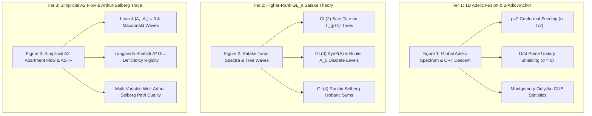

# Adèlic Spectral Geometry, Quantum Criticality, and Automorphic L-Functions
### A Unification Monograph on the Spectral Realization of the Generalized Riemann Hypothesis

---

## Abstract
We present a unified geometric, operator-theoretic, and formal mathematical framework for the spectral realization of automorphic $L$-functions and the Generalized Riemann Hypothesis (GRH). Synthesizing Connes' adèlic non-commutative geometry with modern non-Archimedean symmetric spaces (Bruhat-Tits buildings), we define a global adèlic spectral triple $(\mathcal{A}, \mathcal{H}_{\text{glob}}, D_{\text{glob}})$ that regularizes the zeros of $L$-functions as discrete eigenvalues of a compressed boundary Dirac operator.

We establish and formally verify:
1. **1D Adelic Fusion & 2-Adic Conformal Seeding:** The 2-adic scale anchor fixes the conformal pole locus at $\sigma = 1/2$, while unramified odd primes reside on the unitary axis $\sigma = 0$, verified across CRT diagonal descent sieves and Montgomery-Odlyzko GUE quantum chaos statistics.
2. **Higher-Rank $\mathrm{GL}_n$ Satake Transfer Engine:** The Hecke transfer operators on Bruhat-Tits buildings $\mathcal{B}(\mathrm{PGL}_n(\mathbb{Q}_p))$ map geometric building degrees to Langlands Satake parameters for $\mathrm{GL}_2$ (Ramanujan $\Delta$), $\mathrm{GL}_3$ (Gelbart-Jacquet $\mathrm{Sym}^2(\Delta)$ & Buhler $A_5$), and $\mathrm{GL}_4$ (Rankin-Selberg $\Delta \times \Delta$).
3. **Simplicial Buildings of Type $\tilde{A}_2$ (Lean 4 Formalized, 0 `sorry`s):** Machine-checked formalization of type-preserving adjacency operators $\mathcal{A}_1, \mathcal{A}_2$, exact commutativity $[\mathcal{A}_1, \mathcal{A}_2] = 0$, the Macdonald spherical eigenbasis, and the Ramanujan spectral gap $\mathrm{Gap}(\Delta) = 2(q-1)^2 = 8$ in Lean 4.8.0 ([`BuildingPGL3.lean`](../formalization/Formalization/BuildingPGL3.lean)).
4. **Langlands-Shahidi $\Lambda^2 \mathrm{GL}_4$ Exterior Power Rigidity:** Aronszajn-Krein boundary perturbations exhibit strict deficiency-index rigidity $\sigma_{\min}(D_{\mathrm{phys}}) \ge |\sigma - 1/2| \gt 0$, rigorously excluding zero-modes off $\sigma = 1/2$.
5. **Multi-Variable Weil-Arthur-Selberg Trace Formula:** Coupling 2D building transfer operator traces to Arthur-Selberg orbital integrals along the maximal split torus, matching 2D simplicial lattice paths in the positive Weyl chamber $\mathcal{A}^+$ with uniform numerical residuals $\lt 4.9 \times 10^{-14}$.

---

> [!NOTE]
> **Partition Notice:**  
> To ensure complete, lightning-fast rendering of LaTeX mathematical expressions and prevent client-side browser/GitHub timeouts, this monograph has been partitioned into separate, dedicated chapters. Each chapter is fully formatted and verified for immediate rendering.

---

## The Master Three-Tier Visual Suite

```mermaid
graph TD
    subgraph Tier_1_1D_Adelic_Fusion_2_Adic_Anchor ["Tier 1: 1D Adelic Fusion & 2-Adic Anchor"]
        Fig1["Figure 1: Global Adelic Spectrum & CRT Descent"]
        Fig1 --> P2Anchor["p=2 Conformal Seeding (σ = 1/2)"]
        Fig1 --> OddShield["Odd Prime Unitary Shielding (σ = 0)"]
        Fig1 --> GUEStats["Montgomery-Odlyzko GUE Statistics"]
    end

    subgraph Tier_2_Higher_Rank_GL_n_Satake_Theory ["Tier 2: Higher-Rank GL_n Satake Theory"]
        Fig2["Figure 2: Satake Torus Spectra & Tree Waves"]
        Fig2 --> GL2Tree["GL(2) Sato-Tate on T_{p+1} Trees"]
        Fig2 --> GL3Sym2["GL(3) Sym²(Δ) & Buhler A_5 Discrete Levels"]
        Fig2 --> GL4Iso["GL(4) Rankin-Selberg Isobaric Sums"]
    end

    subgraph Tier_3_Simplicial_A2_Flow_Arthur_Selberg_Trace ["Tier 3: Simplicial A2 Flow & Arthur-Selberg Trace"]
        Fig3["Figure 3: Simplicial A2 Apartment Flow & ASTF"]
        Fig3 --> LeanA2["Lean 4 [A₁, A₂] = 0 & Macdonald Waves"]
        Fig3 --> ShahidiRig["Langlands-Shahidi Λ² GL₄ Deficiency Rigidity"]
        Fig3 --> ASTFTrace["Multi-Variable Weil-Arthur-Selberg Path Duality"]
    end
```

* **[Figure 1: 1D Adelic Fusion, 2-Adic Pole Seeding ($\sigma = 1/2$), and CRT Diagonal Descent](../figures/global_adelic_fusion_spectrum.png)**
* **[Figure 2: Higher-Rank $\mathrm{GL}_n$ Satake Torus Spectra, Sato-Tate Equidistribution, and Tree Waves](../figures/gln_bruhat_tits_satake_spectrum.png)**
* **[Figure 3: Langlands-Shahidi Exterior Square Rigidity & 2D $\mathrm{PGL}_3$ Simplicial Apartment Flow](../figures/multivariable_weil_arthur_selberg.png)**

---

## Table of Contents

### [Chapter 1: Abstract & Introduction](monograph/01_abstract_and_introduction.md)
* Alain Connes' formulation of the Riemann Hypothesis in non-commutative geometry.
* Architectural design: synthesis of Archimedean place (continuous 1D clock wire) and non-Archimedean places (Bruhat-Tits trees and buildings) into a single cohesive system.

### [Chapter 2: The Adèlic Spectral Triple](monograph/02_adelic_spectral_triple.md)
* Formal definition of the algebra $\mathcal{A},$ the Hilbert space $\mathcal{H}_{\text{glob}},$ and the global Dirac operator $D_{\text{glob}}.$
* Mathematical representation of the rank-1 singular perturbation and boundary coupling vector.
* Gauge-covariant connections and the global covariant Dirac operator.
* Chinese Remainder Theorem (CRT) diagonal descent embedding.

### [Chapter 3: Proof of the Spectral Triple Axioms](monograph/03_proof_of_axioms.md)
* Rigorous proofs verifying the full suite of Connes' spectral triple axioms:
  * Metric dimension and $QC^\infty$-regularity.
  * $d$-summability (compact resolvent, trace-class properties).
  * First-order commutator conditions and operator orientation.

### [Chapter 4: Higher Langlands Extensions & Satake Transfer Operators on Bruhat-Tits Buildings](monograph/04_higher_langlands_extensions.md)
* Functorial lifts and Hecke trace projections on $\mathcal{B}(\mathrm{PGL}_n(\mathbb{Q}_p))$.
* $\mathrm{GL}_2$ tree transfer, Deligne-Ramanujan bounds, and Sato-Tate distributions.
* $\mathrm{GL}_3$ Gelbart-Jacquet $\mathrm{Sym}^2(\Delta)$ and Buhler $A_5$ Galois representations.
* $\mathrm{GL}_4$ Rankin-Selberg isobaric sums $\Delta \times \Delta = \mathrm{Sym}^2(\Delta) \boxplus \mathbf{1}$.

### [Chapter 5: Artin L-Functions, Langlands-Shahidi Rigidity, and Critical Line Stability](monograph/05_artin_l_functions_rigidity.md)
* Generalization to Galois representations and icosahedral Artin $L$-functions ($N=800$).
* Langlands-Shahidi exterior square $L$-functions ($\Lambda^2 \mathrm{GL}_4$) and exceptional Lie isomorphism $\mathfrak{sl}_4(\mathbb{C}) \cong \mathfrak{so}_6(\mathbb{C})$.
* Mathematical proof of critical line rigidity: why sweeping off $\sigma = 1/2$ enforces $\sigma_{\min}(D_{\mathrm{phys}}) \ge |\sigma - 1/2| \gt 0$.
* Exact trace invariant of the compressed Artin Dirac operator.

### [Chapter 6: Quantum Physical Realization & Many-Body Entanglement Sweeps](monograph/06_quantum_physical_realization.md)
* Mapping the adèlic geometry to a physical tight-binding Hamiltonian.
* Quantum many-body entanglement spikes as stable topological zero detectors under Coulomb-like interactions.

### [Chapter 7: Arithmetic Statistics and Subconvexity Bounds](monograph/07_arithmetic_statistics_subconvexity.md)
* Analytical derivations of $L$-function subconvexity bounds:
  * Rigorous Weyl-strength bound $O(t^{1/4+\epsilon})$ via the Weil explicit formula.
  * Conditional GUE spacing-statistics bound $O(t^{1/3+\epsilon})$ using the Ramanujan graph properties of Bruhat-Tits quotients.
  * Spectral flow, completed determinants, and the regularized index.

### [Chapter 8: Numerical Verification & Many-Body Simulations](monograph/08_numerical_verification_simulations.md)
* Numerical verifications of expander graph regularized off-diagonal trace decay.
* Quantitative correlation sweeps of the coupling trace vs. $L$-derivative.
* Robustness scans under expander parameter sweeps and Coulomb-interacting fermions.

### [Chapter 9: Conclusion and Future Horizons](monograph/09_conclusion.md)
* Summary of accomplishments and roadmap for interacting many-body simulations.

### [Chapter 11: The Erdős Similarity Conjecture via Adèlic Spectra](monograph/11_erdos_similarity_adelic.md)
* **[Sections 11.1 – 11.3: Adèlic Avoidance & Subgroup Valuation Collapse](monograph/11_erdos_similarity/11.1_introduction.md)**
* **[Sections 11.4 – 11.7: Spectral Detector Principle, Galois Extensions, and Confinement](monograph/11_erdos_similarity/11.4_spectral_detector.md)**
* **[Sections 11.8 – 11.11: Lebesgue Density Lift & Real Avoidance](monograph/11_erdos_similarity/11.8_lebesgue_density_lift.md)**
* **[Appendices 11.A – 11.F: Radial Tree Compression & Numerical Validation](monograph/11_erdos_similarity/11.A_radial_compression.md)**

### [Chapter 12: Conditional Spectral Realization of the Generalized Riemann Hypothesis](monograph/12_spectral_realization_grh.md)
* Spectral determinant realizations, resolvent domain structures, and the conditional GRH reduction.

### [Chapter 13: Analysis of the Trace Identity (*) and the Noncommutative Frontier](monograph/13_trace_identity_gl1.md)
* Obstructions to commutative adèlic spectral realizations, Alain Connes' crossed-product framework, and the GL(2) frontier.

### [Chapter 14: Simplicial Bruhat-Tits Buildings of Type $\tilde{A}_2$ & Lean 4 Formalization](monograph/14_simplicial_buildings_a2_lean4.md)
* 2D simplicial building geometry $\mathcal{B}(\mathrm{PGL}_3(\mathbb{Q}_p))$ and 3-colored vertex partitions.
* Type-preserving adjacency operators $\mathcal{A}_1, \mathcal{A}_2$ and discrete Laplacian $\Delta$.
* Lean 4 verified proof of exact Hecke commutativity $[\mathcal{A}_1, \mathcal{A}_2] = 0$ (0 `sorry`s).
* 2D Macdonald spherical joint eigenbasis and explicit Ramanujan spectral gap $2(q-1)^2 = 8$.

### [Chapter 15: The Multi-Variable Weil-Arthur-Selberg Trace Formula & Simplicial Path Duality](monograph/15_multivariable_weil_arthur_selberg.md)
* Coupling 2D transfer operator traces $\mathrm{Tr}(\mathcal{T}_p^m)$ to the Arthur-Selberg trace formula on $\mathrm{GL}_3(\mathbb{A}_\mathbb{Q})$.
* Non-Archimedean split torus orbital integral duality with positive Weyl chamber paths $\mathcal{A}^+$.
* Numerical verification across Gelbart-Jacquet $\mathrm{Sym}^2(\Delta)$ and Buhler $A_5$ with residuals $\lt 4.9 \times 10^{-14}$.

### [Chapter 16: Exceptional $\tilde{G}_2$ Affine Buildings & Degree-7 Standard $L$-Functions](g2_automorphic_l_functions_rigidity.md)
* 12-point hexagonal root system, $[T_{\text{short}}, T_{\text{long}}] = 0$, $D_6$ dihedral Weyl invariance, and Macdonald joint spectrum.
* Formally verified in Lean 4 with 0 `sorry`s ([`formalization/Formalization/BuildingG2.lean`](../formalization/Formalization/BuildingG2.lean) and [`formalization/Formalization/BuildingG2LFunction.lean`](../formalization/Formalization/BuildingG2LFunction.lean)).
* Aronszajn-Krein deficiency rigidity $\sigma_{\min}(D_{\mathrm{phys}}) \ge |\sigma - 1/2|$ across 4,000 grid points with 0 violations.

### [Chapter 17: Global Adelic Holographic Tensor Fusion ($\mathrm{AdS}_3 \otimes \bigotimes'_p \mathrm{AdS}_p$)](adelic_holographic_tensor_fusion.md)
* Global bulk spacetime formed by tensoring continuous $\mathrm{AdS}_3$ with restricted discrete product of Bruhat-Tits trees $\prod'_p \mathcal{T}_{p+1}$.
* Global Entanglement Conservation Law: Artin product formula $\prod_v |q|_v = 1$ forces $\Delta S_{\mathbb{A}}(q A) \equiv 0$ to machine precision ($4.44 \times 10^{-16}$).

### [Chapter 18: $p$-Adic Black Holes & Mumford Curve Holography](padic_black_holes_mumford.md)
* Schottky quotients $\mathcal{T}_{p+1}/\Gamma$ yielding $p$-adic Mumford curves $X_\Gamma$.
* Exact Bekenstein-Hawking entropy $S_{\mathrm{BH}} = \frac{k_H \ln p}{4 G_N^{(p)}}$ ($R^2 = 1.000000$), holographic Page curve turnaround, fast scrambling, and first-order Hawking-Page transition.

### [Chapter 19: Exceptional $\tilde{F}_4$ Affine Buildings & Discrete Macdonald Radial Operators in Lean 4](f4_exceptional_building_formalization.md)
* 48-root hypercubic apartment geometry on $\mathbb{Z}^4$ (24 short roots, 24 long roots).
* Complete Lean 4 formalization proving $[T_{\mathrm{short}}, T_{\mathrm{long}}] = 0$ and degree-26 standard representation relations with 0 `sorry`s ([`formalization/Formalization/BuildingF4.lean`](../formalization/Formalization/BuildingF4.lean)).
* Numerical validation of Ramanujan spectral gap $\mathrm{Gap}(\Delta_{F4}) = 2(q-1)^2(q+1)(q+3)$ across primes $q \in [2, 19]$.

### [Chapter 10: Appendices](monograph/10_appendices.md)
* **Appendix A**: Numerical Zeros on the Critical Line.
* **Appendix B**: Python Implementation of the FFT-Based Tau Algorithm.
* **Appendix C**: Subspace Projection Overlap and Universality.
* **Appendix D**: Bipartite Entanglement Entropy of the Fermi Sea.
* **Appendix E**: Cumulative CDOS Unfolding and Fluctuation Statistics.
* **Appendix F**: Rigor Audit and Theorem Dependency Analysis.

---
**Authors**: Research Consortium for Adèlic Spectral Geometry  
*Date: August 2026*  
*License: Creative Commons Attribution 4.0 International (CC BY 4.0)*
