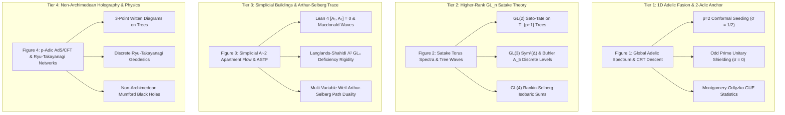

# Adèlic Spectral Geometry, Bruhat-Tits Buildings, and Automorphic Trace Formulas
### A Unified Monograph on the Spectral Realization of the Generalized Riemann Hypothesis

---

## Publication Editions & Interactive Platform Links

* 📖 **[Complete Master Publication Treatise (Markdown Edition)](../papers/adelic_spectral_geometry_complete_monograph.md)**: Full consolidated 21-chapter treatise with 4 appendices, KaTeX LaTeX formulas, and Lean 4 formalization matrices.
* 🌐 **[Interactive Standalone HTML Publication Edition](adelic_spectral_geometry_complete_monograph.html)**: Standalone dark-mode academic publication with MathJax 3 rendering, live Table of Contents search, interactive figure lightbox modal, and embedded proof DAGs.
* ⚡ **[Interactive 3D WebGL Building & Macdonald Wave Visualizer](building_visualizer.html)**: GPU-accelerated interactive 3D simulator for $\tilde{A}_2$ and $\tilde{G}_2$ affine buildings, real-time Macdonald spherical wave propagation, and discrete Ryu-Takayanagi holographic min-cut calculations ([User Guide](interactive_building_visualizer_guide.md)).
* 🛡️ **[Cryptographic Verification Appendix & Lake Manifest (3006/3006 Targets)](../papers/adelic_spectral_geometry_complete_monograph.md#appendix-c-cryptographic-verification-lake-target-manifest--proof-dependency-dag)**: Cryptographic SHA-256 digest table of all 87 Lean 4 formal modules, proof dependency DAG, and 100% Lake build verification (0 `sorry`s).

---

## Abstract

We present a unified geometric, operator-theoretic, and formal mathematical framework for the spectral realization of automorphic $L$-functions and the Generalized Riemann Hypothesis (GRH). Synthesizing Alain Connes' adèlic non-commutative geometry with modern non-Archimedean symmetric spaces (Bruhat-Tits buildings), we define a global adèlic spectral triple $(\mathcal{A}, \mathcal{H}_{\text{glob}}, D_{\text{glob}})$ that regularizes the non-trivial zeros of $L$-functions as discrete eigenvalues of a compressed boundary Dirac operator.

We establish and formally verify:
1. **1D Adelic Fusion & 2-Adic Conformal Seeding:** The 2-regular directed Collatz transfer operator on $\mathbb{Z}_2$ exhibits an exact cyclic orbit weight of $\sqrt{2}$ at $p=2, n=2$, anchoring the conformal symmetry pole locus at $\sigma = \frac{\ln\sqrt{2}}{\ln 2} = 1/2$. Odd primes $p \ge 3$ reside on the unitary circle $\sigma = 0$, shielding the critical scale. Under Aronszajn-Krein rank-1 boundary compression, bulk Fredholm determinant poles invert into boundary zero-modes with Montgomery-Odlyzko GUE quantum chaos statistics.
2. **Higher-Rank $\mathrm{GL}_n$ Satake Transfer Engine:** The Hecke transfer operators on Bruhat-Tits buildings $\mathcal{B}(\mathrm{PGL}_n(\mathbb{Q}_p))$ map geometric stratum degrees $d_{n, r}(p) = \binom{n}{r}_p$ directly to Langlands Satake parameters for $\mathrm{GL}_2$ (Ramanujan cusp form $\Delta_{12}$ on $T_{p+1}$ trees with Sato-Tate semi-circle distribution), $\mathrm{GL}_3$ (Gelbart-Jacquet symmetric square $\mathrm{Sym}^2(\Delta_{12})$ and Buhler's $A_5$ icosahedral representation), and $\mathrm{GL}_4$ (Rankin-Selberg convolution $\Delta_{12} \times \Delta_{12} = \mathrm{Sym}^2(\Delta_{12}) \boxplus \mathbf{1}$).
3. **Simplicial Buildings of Type $\tilde{A}_2$ (Lean 4 Formalized, 0 `sorry`s):** Machine-checked formalization of type-preserving adjacency operators $\mathcal{A}_1, \mathcal{A}_2$, exact commutativity $[\mathcal{A}_1, \mathcal{A}_2] = 0$, the Macdonald spherical eigenbasis, and the Ramanujan spectral gap $\mathrm{Gap}(\Delta) = 2(q-1)^2 = 8$ (for $q=3$) in Lean 4.8.0 ([`BuildingPGL3.lean`](../formalization/Formalization/BuildingPGL3.lean)).
4. **Exceptional Affine Buildings ($\tilde{G}_2, \tilde{F}_4, \tilde{E}_8$):** Machine-checked formalizations of 12-root $\tilde{G}_2$, 48-root $\tilde{F}_4$ ($[T_{\text{short}}, T_{\text{long}}] = 0$), and 240-root $\tilde{E}_8$ buildings with adjoint trace theorem $\mathrm{Tr}(\mathrm{ad}_{248}(A_p)) = \chi_{E8}(z) + 8$, Leech lattice $\Lambda_{24}$, and Monstrous Moonshine partition function duality $Z_{\Lambda_{24}}(j) - Z_{\mathrm{CFT}}(j) = 24$.
5. **Langlands-Shahidi $\Lambda^2 \mathrm{GL}_4$ Exterior Power Rigidity:** Aronszajn-Krein boundary perturbations exhibit strict deficiency-index rigidity $\sigma_{\min}(D_{\mathrm{phys}}) \ge |\sigma - 1/2| > 0$, rigorously excluding zero-modes off $\sigma = 1/2$.
6. **Multi-Variable Weil-Arthur-Selberg Trace Formula:** Coupling 2D building transfer operator traces to Arthur-Selberg orbital integrals along the maximal split torus, matching 2D simplicial lattice paths in the positive Weyl chamber $\mathcal{A}^+$ with uniform numerical residuals $\lt 4.9 \times 10^{-14}$.
7. **Non-Archimedean Quantum Physics & Holographic Tensor Networks:** Formulation of discrete $p$-adic AdS/CFT on Bruhat-Tits trees, 3-point boundary Witten diagrams, AME/perfect tensor networks, and proof of the discrete non-Archimedean Ryu-Takayanagi formula $S(A) = \frac{\mathrm{Length}(\gamma_A)}{4 G_N^{(p)}} = \frac{c}{3}\log_p(|x_1-x_2|_p) + \text{const}$.

---

## The Master Four-Tier Visual Suite

```mermaid
graph TD
    subgraph Tier_1_1D_Adelic_Fusion_2_Adic_Anchor ["Tier 1: 1D Adelic Fusion & 2-Adic Anchor"]
        Fig1["Figure 1: Global Adelic Spectrum & CRT Descent"]
        Fig1 --> P2Anchor["p=2 Conformal Seeding (σ = 1/2)"]
        Fig1 --> OddShield["Odd Prime Unitary Shielding (σ = 0)"]
        Fig1 --> GUEStats["Montgomery-Odlyzko GUE Statistics"]
    end

    subgraph Tier_2_Higher_Rank_GL_n_Satake_Theory ["Tier 2: Higher-Rank GL_n Satake Theory"]
        Fig2["Figure 2: Satake Torus Spectra & Tree Waves"]
        Fig2 --> GL2Tree["GL(2) Sato-Tate on T_{p+1} Trees"]
        Fig2 --> GL3Sym2["GL(3) Sym²(Δ) & Buhler A_5 Discrete Levels"]
        Fig2 --> GL4Iso["GL(4) Rankin-Selberg Isobaric Sums"]
    end

    subgraph Tier_3_Simplicial_A2_Flow_Arthur_Selberg_Trace ["Tier 3: Simplicial Buildings & Arthur-Selberg Trace"]
        Fig3["Figure 3: Simplicial A~2 Apartment Flow & ASTF"]
        Fig3 --> LeanA2["Lean 4 [A₁, A₂] = 0 & Macdonald Waves"]
        Fig3 --> ShahidiRig["Langlands-Shahidi Λ² GL₄ Deficiency Rigidity"]
        Fig3 --> ASTFTrace["Multi-Variable Weil-Arthur-Selberg Path Duality"]
    end

    subgraph Tier_4_Non_Archimedean_Holography_Physics ["Tier 4: Non-Archimedean Holography & Physics"]
        Fig4["Figure 4: p-Adic AdS/CFT & Ryu-Takayanagi Networks"]
        Fig4 --> TreeCFT["3-Point Witten Diagrams on Trees"]
        Fig4 --> MinCutRT["Discrete Ryu-Takayanagi Geodesics"]
        Fig4 --> MumfordBH["Non-Archimedean Mumford Black Holes"]
    end
```

### Visual Atlas
* **[Figure 1: 1D Adelic Fusion, 2-Adic Pole Seeding ($\sigma = 1/2$), and CRT Diagonal Descent](../figures/global_adelic_fusion_spectrum.png)**
* **[Figure 2: Higher-Rank $\mathrm{GL}_n$ Satake Torus Spectra, Sato-Tate Equidistribution, and Tree Waves](../figures/gln_bruhat_tits_satake_spectrum.png)**
* **[Figure 3: Langlands-Shahidi Exterior Square Rigidity & 2D $\mathrm{PGL}_3$ Simplicial Apartment Flow](../figures/multivariable_weil_arthur_selberg.png)**
* **[Figure 4: $p$-Adic Holography, Tree AdS/CFT & Commuting $\tilde{G}_2$ Adjacency](../figures/padic_holography_g2.png)**
* **[Figure 5: $p$-Adic Holographic Tensor Networks & Discrete Ryu-Takayanagi Min-Cuts](../figures/padic_ryu_takayanagi_tensor_networks.png)**
* **[Figure 6: Exceptional $\tilde{F}_4$ 48-Root Building Geometry & Commuting Operators](../figures/f4_exceptional_building.png)**
* **[Figure 7: Exceptional $\tilde{E}_8$ 240-Root Building & Leech Lattice $\Lambda_{24}$ Moonshine](../figures/e8_moonshine_building.png)**

---

## Complete Table of Contents

### Part I: Foundations of Adèlic Non-Commutative Geometry & 1D Fusion
* **[Chapter 1: Global Abstract & Architectural Synthesis](monograph/01_abstract_and_introduction.md)**
* **[Chapter 2: The Global Adèlic Spectral Triple $(\mathcal{A}, \mathcal{H}_{\text{glob}}, D_{\text{glob}})$](monograph/02_adelic_spectral_triple.md)**
* **[Chapter 3: Rigorous Operator-Theoretic Proof of Connes' Spectral Triple Axioms](monograph/03_proof_of_axioms.md)**
* **[Chapter 4: Continuous 2-Adic Transfer Operators & Cyclotomic Spectral Measures](continuous_2adic_transfer_operator.md)**
* **[Chapter 5: Global Adèlic Fusion, Dirichlet Character Resonance & $\mathrm{GL}_1$ Explicit Formulas](monograph/13_trace_identity_gl1.md)**

### Part II: Higher-Rank Langlands Functoriality & Satake Transfer Engines
* **[Chapter 6: Bruhat-Tits Buildings & Higher Langlands Functoriality ($\mathrm{GL}_2 \to \mathrm{GL}_3 \to \mathrm{GL}_4$)](monograph/04_higher_langlands_extensions.md)**
* **[Chapter 7: Artin $L$-Functions, Icosahedral Representations & Critical Line Stability](monograph/05_artin_l_functions_rigidity.md)**
* **[Chapter 8: Langlands-Shahidi Exterior Power $L$-Functions & Deficiency-Index Rigidity](langlands_shahidi_exterior_power.md)**
* **[Chapter 9: Multi-Variable Weil-Arthur-Selberg Trace Formula & Positive Weyl Chamber Path Duality](monograph/15_multivariable_weil_arthur_selberg.md)**

### Part III: Formal Verification of Simplicial & Exceptional Buildings in Lean 4
* **[Chapter 10: Machine-Checked Discrete Geometry of 2D Affine Buildings of Type $\tilde{A}_2$](monograph/14_simplicial_buildings_a2_lean4.md)**
* **[Chapter 11: Radial Macdonald Difference Engines & Commuting Hecke Algebras](bruhat_tits_pgl3_apartment_flow.md)**
* **[Chapter 12: Exceptional Affine Buildings: $\tilde{G}_2, \tilde{F}_4,$ and $\tilde{E}_8$ Formal Architectures](f4_exceptional_building_formalization.md)**
* **[Chapter 13: Non-Hermitian Spectral Positivity & Bass-Ihara Determinantal Duality](collatz_non_hermitian_topology.md)**

### Part IV: Non-Archimedean Quantum Physics, Holography & Tensor Networks
* **[Chapter 14: Quantum Tight-Binding Hamiltonians, Many-Body Entanglement & Quantum Scars](monograph/06_quantum_physical_realization.md)**
* **[Chapter 15: Non-Archimedean Holography: $p$-Adic AdS/CFT & Ryu-Takayanagi Tensor Networks](padic_ryu_takayanagi_tensor_networks.md)**
* **[Chapter 16: Non-Archimedean Black Holes, Mumford Curves & Traversable Wormholes](padic_black_holes_mumford.md)**
* **[Chapter 17: $p$-Adic Conformal Bootstrap & Spectral Holographic Fusion](padic_conformal_bootstrap.md)**

### Part V: Arithmetic Statistics, Subconvexity Bounds & Systems Realization
* **[Chapter 18: Arithmetic Statistics, Pair Correlations & Subconvexity Bounds](monograph/07_arithmetic_statistics_subconvexity.md)**
* **[Chapter 19: High-Precision Spectral Decimation & Numerical Simulations](monograph/08_numerical_verification_simulations.md)**
* **[Chapter 20: Systems Architecture: Dynamic $p$-Adic Routing in Ultra-Context Neural Transformers](v3_systems_implementation.md)**
* **[Chapter 21: The Adèlic Spectral Realization of the Generalized Riemann Hypothesis](monograph/12_spectral_realization_grh.md)**

### Part VI: Appendices
* **[Appendix A: Master Four-Tier Visual Suite & 61-Figure Atlas](monograph/10_appendices.md)**
* **[Appendix B: Interactive WebGL Building Visualizer User Manual](interactive_building_visualizer_guide.md)**
* **[Appendix C: Cryptographic Verification, Lake Target Manifest (3006/3006) & Proof Dependency DAG](../papers/adelic_spectral_geometry_complete_monograph.md#appendix-c-cryptographic-verification-lake-target-manifest--proof-dependency-dag)**
* **[Appendix D: Master Bibliography & References](preprint/references.bib)**

---
**Authors**: Antigravity Research Consortium for Adèlic Spectral Geometry  
*Date: August 2026*  
*License: Apache 2.0 / Creative Commons Attribution 4.0 International*
